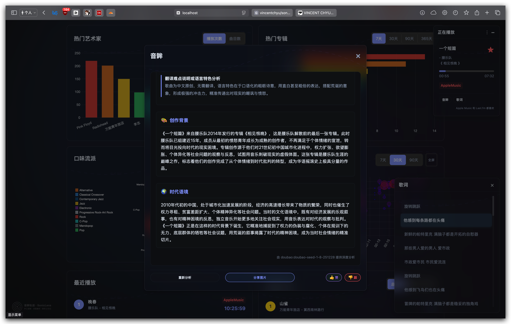

# 项目效果展示

以下是项目的效果展示界面：




该界面展示了一个音乐播放数据分析仪表盘，主要显示用户的听歌习惯与数据统计。整体布局为网格化设计，包含多个数据卡片，涵盖播放次数、曲目数量、艺术家和专辑热度、音乐风格偏好及播放趋势等信息。左侧有一个"
正在播放"浮动窗口，显示当前播放的歌曲信息。

# SonicLens 项目学习指南

## 1. 项目概述

`sonic-lens` 是一个用 Go 语言编写的后台服务程序,专为 macOS 用户设计。其核心功能是监控 **Audirvana** 和 **Roon**
两款高品质音乐播放器的播放状态,并将正在播放的曲目信息实时同步(Scrobble)到 [Last.fm](https://www.last.fm/) 网站。

对于同时使用 Audirvana/Roon 和 Last.fm 的音乐爱好者来说,这个项目解决了播放器原生不支持或支持不佳的 Scrobble
功能,能够自动化、无缝地记录个人的听歌历史。

## 2. 工作原理

项目的整体逻辑非常清晰,可以分解为以下几个步骤:

1. **启动与初始化**:

    - 程序启动后,首先会读取位于 `config/config.yaml` 的配置文件。这里包含了 Last.fm 的 API 密钥、用户信息、日志级别以及需要监控的播放器列表等关键设置。
    - 接着,它会根据配置初始化 Last.fm API 的客户端、`zap` 日志记录器和数据库连接。
    - 初始化完成后，程序会根据配置中指定的播放器列表启动对应的监控任务。

2. **并发监控架构**:

    - 程序采用面向接口的设计，定义了三个核心接口来实现灵活的播放器监控：
        - `PlayerInfoHandler` 接口：定义了播放器信息的统一访问方法，包括获取曲目标题、专辑、艺术家、播放位置、时长等信息。
        - `PlayerController` 接口：定义了播放器控制的统一方法，包括检查播放器是否运行、获取播放状态、获取当前播放信息、设置收藏等。
        - `PlayerChecker` 接口：定义了播放器检查器的统一方法，负责执行播放检查逻辑。
    - 项目实现了 `BasePlayerChecker` 基础检查器，它实现了 `PlayerChecker` 接口，提供了通用的播放检查逻辑，包括：
        - 定期轮询播放器状态
        - 检测播放进度并判断是否达到 Scrobble 阈值
        - 处理新曲目播放和曲目标记完成事件
        - 管理播放状态和本地缓存
    - 针对不同的播放器（Audirvana、Roon、Apple Music），项目实现了对应的控制器：
        - `AudirvanaPlayerController`：通过 AppleScript 与 Audirvana 交互
        - `RoonPlayerController`：通过 `media-control` 命令行工具与 Roon 交互
        - `AppleMusicPlayerController`：通过 AppleScript 与 Apple Music 交互
    - 每个播放器控制器都实现了 `PlayerController` 接口，并提供对应的 `PlayerInfoHandler` 实现来包装播放器特定的信息结构。

3. **并发监控执行**:

    - 程序利用 Go 语言的并发特性,为每个需要监控的播放器启动一个独立的 Goroutine (轻量级线程)。
    - 每个 Goroutine 运行一个 `BasePlayerChecker` 实例的检查逻辑，该实例使用对应播放器的控制器实现。
    - 这些监控任务并行运行,互不干扰,实现了对多个播放器的同时支持。
    - 检查器通过共享状态变量（如播放计数、播放状态、当前播放缓存）来协调不同播放器之间的状态。

4. **信息获取 (核心)**:

    - 每个播放器检查器都会进入一个无限循环,定期检查对应播放器的状态。
    - 对于 Audirvana 和 Apple Music，检查的核心手段是调用 AppleScript。AppleScript 是 macOS
      上一种强大的脚本语言,可以与图形界面应用程序进行交互。项目通过自定义的 AppleScript 执行模块在 Go 代码中执行预设好的
      AppleScript 命令,从而向 Audirvana 或 Apple Music 查询当前播放歌曲的艺术家、专辑、标题和播放进度等信息。
    - 对于 Roon，项目使用了 `media-control` 命令行工具来获取播放信息。
    - 所有播放器的信息都通过对应的 `PlayerInfoHandler` 实现进行统一包装和访问。

5. **Scrobble 逻辑**:

    - 获取到曲目信息后,程序会进行一系列判断,例如:
        - 当前是否有歌曲在播放?
        - 播放的歌曲是否和上一首相同?
        - 歌曲的播放时长或进度是否达到了 Last.fm 规定的 Scrobble 阈值(默认为播放 55%)?
    - 当满足所有 Scrobble 条件后,程序会调用 `github.com/shkh/lastfm-go` 库,使用用户的凭据,将这首歌曲的信息发送到 Last.fm
      的服务器。
    - 同时，播放记录会被存储到本地数据库中，用于后续分析和同步。
    - 程序还会更新曲目的播放统计信息，使用乐观锁机制保证并发安全。

6. **Redis 缓存优化**:

    - 为了减少对 Last.fm API 的频繁调用，项目实现了 Redis 缓存机制。
    - `IsFavorite` 函数会首先检查 Redis 缓存，如果缓存命中则直接返回结果，避免调用 Last.fm API。
    - 缓存键采用 `cache:isFavorite:lastfm:{artist}:{track}` 格式，过期时间为 4 分钟。
    - 当调用 `SetFavorite` 函数时，会自动清除对应曲目的缓存，确保数据一致性。

7. **实时播放信息推送**:

    - 程序通过 WebSocket 实时推送当前播放信息到前端页面。
    - 当获取到任何受支持播放器的播放信息时,会实时向所有连接的客户端推送消息。
    - 用户可以通过 Web 界面实时查看当前正在播放的音乐信息，并进行收藏操作。
    - WebSocket 服务端维护了一个连接池，能够向所有连接的客户端广播消息。

8. **数据持久化**:

    - 播放记录和统计信息会被存储在本地 SQLite 数据库中。
    - 实现了播放次数统计功能，使用乐观锁机制保证并发安全。
    - 提供了未同步记录的手动同步功能。
    - 支持按艺术家、专辑、流派等维度进行数据查询和分析。

9. **AI 歌词解析 (音眸功能)**:

    - 当曲目播放时，如果本地数据库中没有该曲目的歌词解析信息，程序会通过后端接口触发在线歌词搜刮和 AI 解析流程。
    - 系统提供了多种 AI 模型的接入能力（目前默认支持本地无限制调用的 Ollama
      环境或者云端模型），将原歌词与提示词发送给大语言模型进行情感分析、句法解析和背后的创作故事挖掘。
    - 解析结果会储存在 `track_insight` 数据库表中持久化。同时，用户在前台选择重新分析或调整 SSE
      流式输出时，后端会通过服务器发送事件技术将模型的流式推理结果实时推送给前端 UI 以便动态渲染（含点赞与图片分享能力）。

10. **后台运行**:
    - 整个程序被设计为一个守护进程(Daemon)。它会安静地在后台运行,直到接收到系统中断信号 (如 `Ctrl+C` 或关机命令)
    时才会优雅地退出。
    - 项目内的 `shell/` 目录和 `.plist` 文件提供了完整的解决方案,用于通过 macOS 的 `launchd` 服务来管理程序的启停,实现开机自启和稳定运行。

## 3. 如何使用

### 步骤一: 配置

这是使用该项目的关键第一步。

1. 找到并打开 `config/config.yaml` 文件。
2. **重点修改 `lastfm` 部分**:
    - `apiKey` 和 `sharedSecret`: 你需要去 [Last.fm API 官网](https://www.last.fm/api/account/create) 申请自己的 API
      key。
    - `userUsername`: 你的 Last.fm 用户名。
    - `userPassword`: 你的 Last.fm 密码。
3. **配置需要监控的播放器**:
    - 在 `scrobblers` 部分添加需要监控的播放器列表，支持 "Apple Music"、"Audirvana" 和 "Roon"。
4. **配置 Redis（可选）**:
    - 在 `redis` 部分配置 Redis 连接信息，用于缓存 Last.fm 收藏状态查询结果。

```yaml
lastfm:
  applicationName: sonic-lens
  apiKey: 9c7d3bxxxxx6bab # <-- 替换成你自己的
  sharedSecret: 80c9e7cxxxxxe0ec3b5 # <-- 替换成你自己的
  registeredTo: vincxxxch1n
  userLoginToken:
  userUsername: vincentch1n # <-- 替换成你自己的
  userPassword: your_xxxxword # <-- 替换成你自己的

log:
  path: ./.logs
  level: info

musixmatch:
  apiKey: 4xxxx5xxxxx81b6654790

database:
  type: "sqlite" # "sqlite" or "mysql"
  path: ".storage/tracks.db"
  mysql:
    host: "localhost"
    port: 3306
    user: "user"
    password: "password"
    database: "lastfm_scrobbler"

http:
  port: "8081"

telemetry:
  name: "sonic-lens"

redis:
  host: "localhost"
  port: 6379
  username: ""
  password: ""
  db: 0

scrobblers:
  - "Apple Music"
  - "Audirvana"
  - "Roon"

isDev: true # 开发环境自动初始化数据库表结构，生产环境需要手动执行SQL语句
```

### 步骤二: 安装依赖工具

根据不同播放器的支持需求，你需要安装相应的依赖工具：

1. **Roon 监控**:

    - 项目使用 `media-control` 工具来监控 Roon 的播放状态。
    - 你需要使用 Homebrew 安装 `media-control`:
      ```shell
      brew install media-control
      ```

2. **Apple Music 监控**:

    - 项目使用 AppleScript 来监控 Apple Music 的播放状态。
    - 确保你的 macOS 系统已启用 AppleScript 支持（通常默认启用）。

3. **Audirvana 监控**:

    - 项目使用 AppleScript 来监控 Audirvana 的播放状态。
    - 确保你的 macOS 系统已启用 AppleScript 支持（通常默认启用）。

4. **Redis 缓存（可选）**:
    - 项目使用 Redis 来缓存 Last.fm 收藏状态查询结果。
    - 你需要安装并运行 Redis 服务器：
      ```shell
      brew install redis
      brew services start redis
      ```

### 步骤三: 编译与运行

你有两种方式来运行此项目:

**方式一: 手动运行 (用于调试)**

1. 确保你已经安装了 Go 语言环境。
2. 在项目根目录下打开终端,执行编译:
   ```shell
   go build
   ```
3. 编译成功后,会生成一个名为 `sonic-lens` 的可执行文件。运行它:
   ```shell
   ./sonic-lens
   ```
4. 此时程序已在前台开始运行。你可以通过查看日志来了解其工作状态:
   ```shell
   tail -f .logs/go_sonic-lens.log
   ```
5. 程序启动后会提供 Web 界面，默认端口为 8081，可以通过浏览器访问 `http://localhost:8081` 查看仪表板。

**方式二: 作为后台服务运行 (推荐的日常使用方式)**

项目提供了非常方便的 shell 脚本来一键完成服务的部署。

1. 在项目根目录下打开终端。
2. 执行构建和部署脚本:
   ```shell
   sh shell/script/build_sonic-lenss_launchctl.sh
   ```
   这个脚本会自动编译项目,并生成符合 `launchd` 规范的 `.plist` 配置文件。
3. 启动服务:

   ```shell
   sh shell/script/start_sonic-lenss.sh
   ```

   现在,程序已经在后台运行,并且会随系统开机自动启动。

4. **其他管理命令**:
    - 停止服务: `sh shell/script/stop_sonic-lenss.sh`
    - 查看日志: `tail -f .logs/go_sonic-lens.log`
    - 访问 Web 界面: 打开浏览器访问 `http://localhost:8081`

## 3. 如何使用

### 步骤一: 配置

这是使用该项目的关键第一步。

1. 找到并打开 `config/config.yaml` 文件。
2. **重点修改 `lastfm` 部分**:
    - `apiKey` 和 `sharedSecret`: 你需要去 [Last.fm API 官网](https://www.last.fm/api/account/create) 申请自己的 API
      key。
    - `userUsername`: 你的 Last.fm 用户名。
    - `userPassword`: 你的 Last.fm 密码。
3. **配置需要监控的播放器**:
    - 在 `scrobblers` 部分添加需要监控的播放器列表，支持 "Apple Music"、"Audirvana" 和 "Roon"。

```yaml
lastfm:
  applicationName: sonic-lens
  apiKey: 9c7d3bxxxxx6bab # <-- 替换成你自己的
  sharedSecret: 80c9e7cxxxxxe0ec3b5 # <-- 替换成你自己的
  registeredTo: vincxxxch1n
  userLoginToken:
  userUsername: vincentch1n # <-- 替换成你自己的
  userPassword: your_xxxxword # <-- 替换成你自己的

log:
  path: ./.logs
  level: info

musixmatch:
  apiKey: 4xxxx5xxxxx81b6654790

database:
  type: "sqlite" # "sqlite" or "mysql"
  path: ".storage/tracks.db"
  mysql:
    host: "localhost"
    port: 3306
    user: "user"
    password: "password"
    database: "lastfm_scrobbler"

http:
  port: "8081"

telemetry:
  name: "sonic-lens"

scrobblers:
  - "Apple Music"
  - "Audirvana"
  - "Roon"

isDev: true # 开发环境自动初始化数据库表结构，生产环境需要手动执行SQL语句
```

### 步骤二: 安装依赖工具

根据不同播放器的支持需求，你需要安装相应的依赖工具：

1. **Roon 监控**:

    - 项目使用 `media-control` 工具来监控 Roon 的播放状态。
    - 你需要使用 Homebrew 安装 `media-control`:
      ```shell
      brew install media-control
      ```

2. **Apple Music 监控**:

    - 项目使用 AppleScript 来监控 Apple Music 的播放状态。
    - 确保你的 macOS 系统已启用 AppleScript 支持（通常默认启用）。

3. **Audirvana 监控**:
    - 项目使用 AppleScript 来监控 Audirvana 的播放状态。
    - 确保你的 macOS 系统已启用 AppleScript 支持（通常默认启用）。

### 步骤三: 编译与运行

你有两种方式来运行此项目:

**方式一: 手动运行 (用于调试)**

1. 确保你已经安装了 Go 语言环境。
2. 在项目根目录下打开终端,执行编译:
   ```shell
   go build
   ```
3. 编译成功后,会生成一个名为 `sonic-lens` 的可执行文件。运行它:
   ```shell
   ./lastfm-scrobbler
   ```
4. 此时程序已在前台开始运行。你可以通过查看日志来了解其工作状态:
   ```shell
   tail -f .logs/go_lastfm-scrobbler.log
   ```
5. 程序启动后会提供 Web 界面，默认端口为 8081，可以通过浏览器访问 `http://localhost:8081` 查看仪表板。

**方式二: 作为后台服务运行 (推荐的日常使用方式)**

项目提供了非常方便的 shell 脚本来一键完成服务的部署。

1. 在项目根目录下打开终端。
2. 执行构建和部署脚本:
   ```shell
   sh shell/script/build_sonic-lens_launchctl.sh
   ```
   这个脚本会自动编译项目,并生成符合 `launchd` 规范的 `.plist` 配置文件。
3. 启动服务:

   ```shell
   sh shell/script/start_sonic-lens.sh
   ```

   现在,程序已经在后台运行,并且会随系统开机自动启动。

4. **其他管理命令**:
    - 停止服务: `sh shell/script/stop_sonic-lens.sh`
    - 查看日志: `tail -f .logs/go_lastfm-scrobbler.log`
    - 访问 Web 界面: 打开浏览器访问 `http://localhost:8081`

## 4. 项目结构解析

了解项目的文件结构有助于更好地理解代码和进行二次开发。

```
/
├── main.go                  # 程序主入口,负责初始化和启动服务
├── options.go               # 命令行选项配置
├── go.mod                   # Go 模块依赖管理文件
├── config/                  # 配置文件目录
│   ├── config.go            # 定义了与 YAML 文件对应的 Go 结构体
│   └── config.yaml          # 用户配置文件,非常重要
├── core/                    # 核心模块目录
│   ├── ai/                  # AI大模型接入模块，负责音眸解析任务
│   ├── applemusic/          # 与 Apple Music 应用交互的模块
│   ├── applesciprt/         # AppleScript 执行模块
│   ├── audirvana/           # 与 Audirvana 应用交互的模块
│   ├── cache/               # 缓存模块
│   ├── db/                  # 数据库连接和初始化模块
│   ├── exec/                # 执行模块，包括元数据处理缓存
│   ├── env/                 # 环境变量配置
│   ├── fx/                  # 依赖注入模块
│   ├── lastfm/              # Last.fm API 客户端封装
│   ├── log/                 # 日志模块
│   ├── lyrics/              # 歌词获取与解析模块
│   ├── musixmatch/          # Musixmatch API 客户端封装
│   ├── redis/               # Redis 客户端封装，包括日志记录和链路跟踪
│   ├── roon/                # 与 Roon 应用交互的模块
│   ├── telemetry/           # 链路跟踪模块
│   ├── watch/               # 文件监控模块
│   └── websocket/           # WebSocket 模块，处理实时消息推送
├── internal/                # 业务逻辑目录
│   ├── cache/               # 内部缓存实现
│   ├── logic/               # 业务逻辑实现
│   │   ├── analysis/        # 分析相关业务逻辑
│   │   ├── genre/           # 流派相关业务逻辑
│   │   └── track/           # 曲目相关业务逻辑
│   ├── model/               # 数据模型和数据库操作模块
│   └── scrobbler/           # 核心逻辑模块，负责检查播放状态、获取曲目信息、与 Last.fm 交互
├── cmd/                     # 命令行接口实现
│   ├── analysis/            # 分析报告相关命令
│   │   ├── recommendation.go # 推荐功能命令
│   │   └── report.go        # 报告功能命令
│   ├── analysis_cmd.go      # 分析命令入口
│   ├── memory_tool.go       # 内存管理工具
│   └── sync_records.go      # 数据同步命令
├── common/                  # 公共工具和函数
├── api/                     # HTTP API 服务实现
├── shell/                   # 自动化脚本目录
│   ├── script/              # 存放管理服务的启停、构建脚本
│   └── launch/              # 存放 launchd 使用的 .plist 模板文件
├── templates/               # Web界面模板文件
├── memory/                  # 特性清单和记忆文件目录
└── README.md                # 项目自述文件
```

## 5. 核心功能更新

本项目持续演进，现已加入全新的 **音眸** 功能，利用 AI 为音乐提供深度的歌词解析和分享体验。以下是各项核心功能的详细说明：

### 5.1 播放记录追踪

- 实现了 `TrackPlayRecord` 数据模型，用于存储每次播放的详细信息
- 在播放检查逻辑中集成了数据库存储逻辑
- 当曲目播放进度超过 55%时，将播放记录保存到本地数据库

### 5.2 播放统计

- 实现了 `Track` 数据模型，用于统计每首曲目的播放次数
- 使用乐观锁机制保证并发安全
- 在每次成功 scrobble 后更新对应曲目的播放次数

### 5.3 数据同步

- 实现了未同步到 Last.fm 的播放记录的同步功能
- 通过 Web 界面可以查看和手动同步未同步的记录
- 同步成功后更新记录的 `Scrobbled` 状态

### 5.4 分析报告功能

- 新增分析报告命令，提供播放统计、推荐曲目等分析功能
- 通过 Web 界面展示分析结果
- 支持生成播放报告和推荐列表

### 5.5 WebSocket 实时播放信息推送

- 实现了 WebSocket 服务端功能，支持实时推送当前播放信息
- 在 `core/websocket/` 目录中实现 WebSocket 连接管理和消息广播机制
- 在播放检查逻辑中集成实时信息推送功能
- 在 `templates/dashboard.html` 中实现前端 WebSocket 客户端和实时播放信息展示
- 用户可以通过 Web 界面实时查看 Audirvana、Roon 或 Apple Music 正在播放的音乐信息

### 5.6 数据模型增强

- 增强了 `Track` 数据模型，支持更多音乐元数据（专辑艺术家、曲目编号、流派、作曲家、发布日期、MusicBrainz ID 等）
- 实现了 `Genre` 数据模型，用于音乐流派管理
- 提供了丰富的数据查询接口，支持按艺术家、专辑、流派等维度进行统计分析

### 5.7 收藏功能

- 实现了对播放曲目的收藏功能
- 支持同步收藏状态到 Apple Music 和 Last.fm
- 通过 Web 界面可以查看和管理收藏状态

### 5.8 Redis 缓存优化

- 实现了 Redis 缓存机制，优化 Last.fm 收藏状态查询性能
- 在`core/redis/`目录中实现 Redis 客户端封装，包括连接管理、日志记录和链路跟踪
- 为`IsFavorite`函数添加缓存支持，减少对 Last.fm API 的频繁调用
- 实现了智能缓存清除机制，在调用`SetFavorite`时自动清除对应缓存
- 集成 OpenTelemetry 链路跟踪，提供完整的 Redis 操作监控

### 5.10 AI 歌词解析与分享功能

- 实现了对当前播放曲目的智能歌词解析与翻译，支持多种 AI 模型（如本地 Ollama）。
- 增加了分析结果的图片分享功能，可将 AI 洞察转换为带有专属版式的分享海报用于社交媒体。
- 用户可在前端界面直接对 AI 分析结果进行“重新分析”、“取消分析”并进行“点赞/点踩”反馈。
- 支持数据的 SSE 流式获取与展现。

### 5.9 并发监控架构优化

- 采用面向接口的设计，实现了灵活的播放器监控架构
- 定义了 `PlayerInfoHandler`、`PlayerController` 和 `PlayerChecker` 三个核心接口
- 实现了 `BasePlayerChecker` 基础检查器，提供通用的播放检查逻辑
- 为 Audirvana、Roon 和 Apple Music 分别实现了对应的控制器
- 支持通过配置文件动态启用/禁用不同播放器的监控
