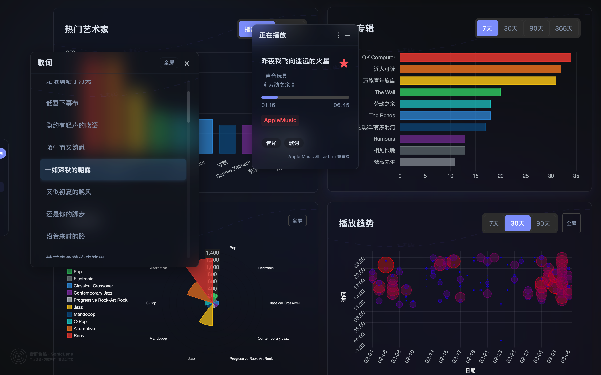
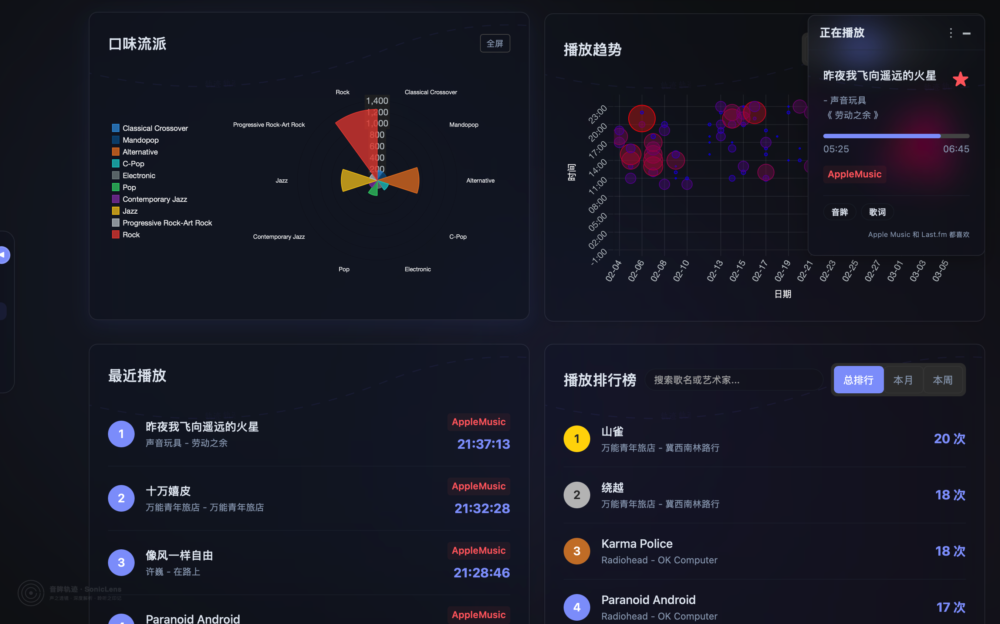
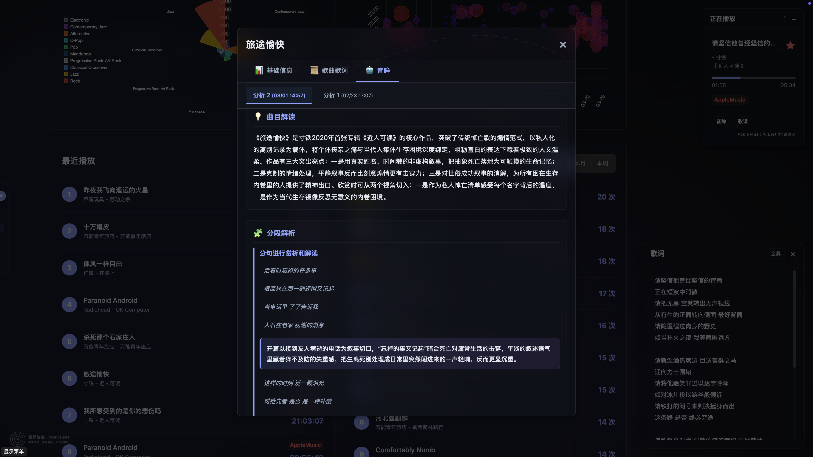
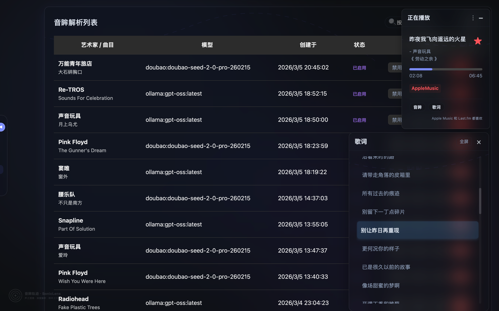
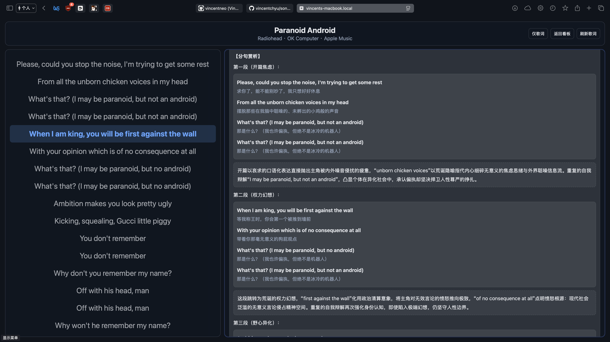
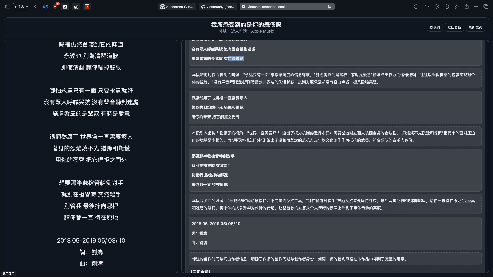

# 引言

* 我要做的第一件事就是让你知道，你接受到的音乐轨迹也是你的数字资产，而你得到你的资产不需要依靠别人、任何平台。
* 当你需要深入了解一首歌曲的时候，就是这个平台要做的第二件事。

# 展示

以下是效果展示界面：






---
# SonicLens 项目学习指南

## 1. 项目概述

> **音眸轨迹 · SonicLens**
>
> 音乐不仅是流动的空气，更是你生命中不曾停歇的**数字资产**。
>
> `sonic-lens` 是一架专为 macOS 乐迷打造的“声之透镜”。它静默地守候在 **Audirvana**、**Roon** 与 **Apple Music** 之后，通过高频采样与无感监控，将每一次聆听凝结为跨越平台的永恒印记。
>
> 在这里，你的听歌历史不再是存储于流媒体服务器上的冷数据，而是属于你个人的、可触碰的**音眸轨迹**。通过 AI 的深度解析，每一首乐曲都将被赋予超越旋律的洞察，转化为不可磨灭的聆听印记。

## 2. 项目结构

```
/
├── core/                    # 核心模块：AI 接入、播放器控制器、Scrobbler 逻辑
├── internal/                # 业务逻辑：数据模型、统计分析
├── api/                     # HTTP 服务接口
├── config/                  # 配置文件
├── shell/                   # 服务管理脚本
├── templates/               # Web 仪表板模板
└── main.go                  # 程序入口
```

## 3. 工作原理

项目通过 **并发监控 -> 状态解析 -> 数据沉淀 -> 智能洞察** 的流式架构运行：

1.  **无感监控**: 基于 Go 并发特性，为每个播放器（Audirvana, Roon, Apple Music）启动独立 Goroutine。
2.  **状态捕获**: 通过 AppleScript 或命令行工具实时采样播放器的元数据（艺术家、曲目、进度）。
3.  **智能 Scrobble**: 遵循 Last.fm 协议，当播放进度达标时自动触发同步，并写入本地数据库。
4.  **音眸解析**: 结合 AI 大模型（如本地 Ollama），对歌词进行深度情感与语义解析。
5.  **实时推送**: 通过 WebSocket 将状态变更秒级推送至 Web 仪表板。

---

## 4. 快速开始

### 第一步：基础配置
编辑 `config/config.yaml`，填入您的 Last.fm 凭据：
```yaml
lastfm:
  apiKey: "YOUR_API_KEY"
  sharedSecret: "YOUR_SHARED_SECRET"
  userUsername: "YOUR_USERNAME"
  userPassword: "YOUR_PASSWORD"

scrobblers: ["Apple Music", "Audirvana", "Roon"]
```

### 第二步：环境准备
- **Roon 用户**: `brew install media-control`
- **Redis 缓存 (可选)**: `brew install redis` (用于加速收藏状态查询)

### 第三步：运行服务

**推荐方式 (后台服务运行):**
```shell
sh shell/script/build_sonic-lens_launchctl.sh  # 编译并部署
sh shell/script/start_sonic-lens.sh            # 启动服务
```

**调试方式 (前台运行):**
```shell
go build -o sonic-lens
./sonic-lens
```
> 访问 Web 仪表板: `http://localhost:8081`

---

## 5. 核心特性

### 🛡️ 资产数字化与沉淀
- **跨平台追踪**: 统一集成 Audirvana, Roon, Apple Music 的聆听历史。
- **本地化自治**: 所有播放数据存储于本地 SQLite，摆脱平台限制，成为个人数字资产。
- **Redis 加速**: 智能缓存 Last.fm 交互状态，响应极速。

### 👁️ 音眸智能洞察 (Sonic Insight)
- **AI 深度解析**: 接入大模型对歌词进行解析、翻译与情感挖掘。
- **SSE 流式渲染**: 洞察结果实时流式呈现，支持点赞与重新分析。
- **印记分享**: 一键生成带有封面与 AI 见解的分享海报，铭刻聆听瞬间。

### ⚡ 实时交互与监控
- **Web 仪表板**: 实时展示当前播放元数据（封面、比特率等）。
- **WebSocket 架构**: 后端变更与前端 UI 保持毫秒级同步。
- **优雅停启**: 配合 macOS `launchd` 实现开机自启与平滑退出。

---

## 6. 开发与贡献

了解详细架构或参与贡献，请参考代码中的 `core/` 与 `internal/` 目录注释。
