# SonicLens 前端重构基线 API 盘点（后端稳定版）

> 盘点来源：`api/server.go` 当前全部路由（含页面、API、WebSocket、健康检查）
> 
> 目标：为前端重构提供“功能域 -> 接口 -> 后端能力”的完整映射。

## 1. 接口总览

- HTTP 路由总数：`58`
- 其中 API 路由（`/api/*`）：`52`
- 页面路由：`4`（`/`、`/admin`、`/lyrics-live`、`/playCounts`）
- 实时路由：`1`（`/ws`）
- 健康检查：`1`（`/health`）
- 封面二进制路由：`1`（`/api/artwork/:key`）
- 静态资源路由（`r.StaticFile` / `r.Static`）：`11`（10 个显式文件 + admin 拆分资源目录）

## 2. 全量接口文档（按前端功能域）

## 2.1 页面与静态资源

| 功能 | 方法 | 路径 | 主要用途 | 主要后端链路 |
|---|---|---|---|---|
| 后台总入口 | GET | `/`、`/admin` | 渲染 `templates/admin.html`，并组合 `templates/admin/*.html` 局部模板；`/` 保留历史入口，`/admin` 作为语义化别名 | Gin + Go template |
| 全屏歌词页 | GET | `/lyrics-live` | 渲染 `templates/pages/lyrics_live.html` | Gin + Go template |
| 播放统计页 | GET | `/playCounts` | 渲染 `templates/pages/track_play_counts.html`，HTML/JSON 双态播放统计 | `trackService.GetTrackPlayCounts` |
| 静态资源 | GET | `/static/*`（10 个显式文件 + `/static/admin/*`） | 前端脚本、样式、Logo、Admin 入口拆分 CSS/JS | `r.StaticFile` / `r.Static` |

## 2.2 专辑封面（Artwork）

| 功能 | 方法 | 路径 | 核心参数 | 返回 | 缓存 | 后端关联 |
|---|---|---|---|---|---|---|
| 封面解析 | GET | `/api/artwork/resolve` | `album_id/albumID`, `albumArtist`, `artist`, `album`, `artworkKey` | `exists`, `cover_art_url`, `cover_art_object_key` | Redis 10m | `artworklogic.Service.Resolve` -> `model.GetAlbum/GetAlbumByArtistAndName` + `objectstorage` |
| 封面二进制读取 | GET | `/api/artwork/:key` | `:key` | 图片流 | 浏览器缓存 1h | `core/artwork.DefaultStore.Get` |

## 2.3 曲目与资料库核心

| 功能 | 方法 | 路径 | 核心参数 | 返回 | 缓存 | 后端关联 |
|---|---|---|---|---|---|---|
| 曲目播放统计列表 | GET | `/api/track-play-counts` | `limit`, `offset`, `keyword`, `format` | JSON 或 HTML | 无 | `trackService.GetTrackPlayCounts` -> `model.GetTracks` |
| 曲目身份查询 | GET | `/api/track` | `artist`, `album`, `trackName`, `trackNumber`, `discNumber` | 曲目详情 + `album_id` | Redis 1m | `trackService.GetTrackByIdentity` + `GetTrackAlbumByTrackID` |
| 最近播放记录 | GET | `/api/recent-plays` | `limit` | 播放流水列表，新增 `cover_art_path` 便于客户端直接渲染封面 | 无 | `trackService.GetRecentPlayRecords` |
| 周/月维度统计 | GET | `/api/track-play-counts/period` | `limit`, `offset`, `period`, `keyword` | 曲目统计列表 | 无 | `trackService.GetTrackPlayCountsByPeriod` |
| 专辑详情（含曲目） | GET | `/api/albums/:id` | `:id` | `AlbumDetail` | Redis 2m | `trackService.GetAlbumDetail` -> `model.GetAlbumWithTracks` |
| 专辑列表 | GET | `/api/albums` | `limit`, `offset`, `keyword` | `albums`, `total` | 无 | `trackService.GetAlbums` + `GetAlbumsCount` |
| 曲目列表（按专辑排序） | GET | `/api/tracks` | `limit`, `offset`, `keyword` | `tracks`, `total` | 无 | `trackService.GetTracksOrderedByAlbum` + `Count` |
| 资料库增量同步 | GET | `/api/library/sync` | `since_version` | `sync_version`, `albums[].has_insight`, `albums[].original_release_date`, `tracks`, `deleted_*_ids` | 无 | `trackService.GetLibrarySyncDelta` -> `model.GetLibrarySyncDelta` |
| 人工解除专辑关联 | POST | `/api/track-album/unlink` | `track_id`, `album_id` | `status` | 无 | `trackService.DeleteTrackAlbumLink` |

## 2.4 Dashboard 统计分析

| 功能 | 方法 | 路径 | 核心参数 | 返回 | 后端关联 |
|---|---|---|---|---|---|
| 核心统计卡片 | GET | `/api/dashboard/stats` | 无 | 总播放/曲目/艺人/专辑 | `trackService.GetTotalPlayCount/GetTrackCounts/GetArtistCounts/GetAlbumCounts` |
| 趋势（日+小时） | GET | `/api/dashboard/trend` | `range`(7/30/90) | `daily`, `hourly` | `GetPlayTrendByDays`，失败回退 `GetRecentPlayRecordsByDays` |
| 热门艺人（播放） | GET | `/api/dashboard/top-artists/plays` | `limit` | 艺人榜（含 `rank`、`play_count`，可选 `avatar_url/avatar_object_key/avatar_mime`） | `GetTopArtistsByPlayCount` |
| 热门艺人（曲目数） | GET | `/api/dashboard/top-artists/tracks` | `limit` | 艺人榜（含 `rank`、`track_count`，可选 `avatar_url/avatar_object_key/avatar_mime`） | `GetTopArtistsByTrackCount` |
| 艺术家资料列表 | GET | `/api/artist-profiles` | `limit`, `offset`, `keyword` | `items`, `total` | `artistprofilelogic.Service.ListProfiles` |
| 热门艺术家候选 | GET | `/api/artist-profiles/top-artists` | `limit` | `items[]` | `artistprofilelogic.Service.ListTopArtistSources` |
| 艺术家头像上传 | POST | `/api/artist-profiles/avatar` | `artist_name`, `data`(data URL/base64) | `profile` | `artistprofilelogic.Service.UploadAvatar` + `objectstorage` |
| 来源播放占比 | GET | `/api/dashboard/play-counts-by-source` | 无 | source->count | `GetPlayCountsBySource` |
| 热门专辑 | GET | `/api/dashboard/top-albums` | `days`, `limit` | 专辑榜（含 `album_id`、封面字段） | `GetTopAlbumsByPlayCount` |
| 热门曲目 | GET | `/api/dashboard/top-tracks` | `days`, `limit` | 曲目榜（基于 `track_rank_stat`，含 `track_id`、封面字段、`rank`） | `GetTopTracksByPlayCount` |
| 热门流派 | GET | `/api/dashboard/top-genres` | `limit` | TopGenre 列表（含 `rank`） | `genreService.GetTopGenresWithDetails` |

## 2.5 AI 解析、异步任务与歌词

| 功能 | 方法 | 路径 | 核心参数 | 返回 | 缓存 | 后端关联 |
|---|---|---|---|---|---|---|
| 可用平台列表 | GET | `/api/ai-models` | 无 | `platforms` | Redis 默认 5m | `insightService.GetAvailableAIPlatforms` |
| 平台模型列表 | GET | `/api/ai-models/:platform/models` | `:platform` | `models` | 无 | `insightService.GetPlatformModels` |
| 创建音眸异步任务 | POST | `/api/insight-jobs` | `target_type(track/album)`, 曲目身份或 `album_id`, `provider`, `model`, `client_platform` | `job`, `existing`；终态 `job` 会携带 `result_insight_id` | 无 | `insightService.CreateInsightJob` -> `model.CreateInsightJob` + 后台 `GetOrCreateInsight/GetOrCreateAlbumInsight` |
| 查询音眸任务列表 | GET | `/api/insight-jobs` | `limit`, `offset`, `keyword`, `status`, `analysis_target_type` | `jobs`, `total` | 无 | `insightService.ListInsightJobs` -> `model.ListInsightJobs` |
| 查询音眸任务状态 | GET | `/api/insight-jobs/:id` | `:id` | `job`, `call_logs`；终态优先通过 `result_insight_id` 闭环读取正文，并返回关联调用流水 | 无 | `insightService.GetInsightJob` + `insightService.GetInsightJobCallLogs` |
| 取消音眸任务 | POST | `/api/insight-jobs/:id/cancel` | `:id` | `job` | 无 | `insightService.CancelInsightJob` -> `model.CancelInsightJob` |
| 删除音眸任务 | DELETE | `/api/insight-jobs/:id` | `:id` | `status` | 仅 `failed` / `canceled` | `insightService.DeleteInsightJob` -> `model.DeleteInsightJob`（同步清理关联 `llm_call_logs`） |
| 重试音眸任务 | POST | `/api/insight-jobs/:id/retry` | `:id` | `job`, `existing` | 无 | `insightService.RetryInsightJob` -> `insightService.CreateInsightJob` |
| 上报 Live Activity token | POST | `/api/insight-jobs/:id/live-activity-token` | `:id`, `token` | `job` | 无 | `insightService.UpdateInsightJobLiveActivityToken` -> `model.UpdateInsightJobLiveActivityToken` |
| 仅读取解析结果 | GET | `/api/track-insight` | `artist`, `album`, `track`, `trackNumber`, `discNumber` | `insights`, `recommended_insight_id` | Redis 1m | `insightService.GetInsightOnly` -> `model.GetTrackInsightsByLookup` |
| 生成/刷新解析 | POST | `/api/track-insight` | `artist`, `album`, `track`, `track_number`, `disc_number`, `provider`, `model`（兼容 `modelType`） | `insights`, `cached`, `recommended_insight_id` | 无 | `insightService.GetOrCreateInsight` -> `core/ai` + `track_lyrics` + `track_insight` |
| 流式解析 SSE | GET | `/api/track-insight-stream` | `artist`, `album`, `track`, `trackNumber`, `discNumber`, `force`, `provider`, `model`（兼容 `modelType`） | SSE `message` | 无 | `insightService.GetOrCreateInsightStream` -> `core/ai` |
| 仅读取专辑解析结果 | GET | `/api/album-insight` | `albumID` | `insights`, `recommended_insight_id` | Redis 1m | `insightService.GetAlbumInsightOnly` -> `model.GetAlbumInsightsByLookup` |
| 生成/刷新专辑解析 | POST | `/api/album-insight` | `album_id`, `provider`, `model`（兼容 `modelType`） | `insights`, `cached`, `recommended_insight_id` | 无 | `insightService.GetOrCreateAlbumInsight` -> `core/ai` + `track_album` + `track_insight` |
| 曲目解析反馈 | POST | `/api/track-insight/:id/feedback` | `:id`, `score`, `comment`, `reason_codes[]`（`不准确/太空泛/不贴合歌曲/专辑/缺少关键信息/结构混乱/其他`）, `section_key`, `source_platform` | `status` | 无 | `insightService.RecordFeedback` -> `track_insight_feedbacks` |
| 专辑解析反馈 | POST | `/api/album-insight/:id/feedback` | `:id`, `score`, `comment`, `reason_codes[]`（`不准确/太空泛/不贴合歌曲/专辑/缺少关键信息/结构混乱/其他`）, `section_key`, `source_platform` | `status` | 无 | `insightService.RecordAlbumFeedback` -> `album_insight_feedbacks` |
| 解析反馈摘要 | GET | `/api/insights/:id/feedback-summary` | `:id`, `analysis_target_type`(`track`/`album`) | `like_count`, `dislike_count`, `latest_feedback`, `latest_negative_feedback`, `top_reason_codes`, `has_feedback` | 无 | `insightService.GetInsightFeedbackSummary` |
| 解析反馈历史 | GET | `/api/insights/:id/feedback-history` | `:id`, `analysis_target_type`(`track`/`album`), `limit` | `feedbacks` | 无 | `insightService.GetInsightFeedbackHistory` |
| 解析历史版本清单 | GET | `/api/insights/:id/history` | `:id`, `analysis_target_type`(`track`/`album`), `limit` | `insights`, `total`, `limit`, `offset`, `analysis_target_type`, `recommended_insight_id` | 无 | `insightService.GetInsightHistory` |
| 解析列表后台 | GET | `/api/insights/all` | `limit`, `offset`, `keyword`, `analysis_target_type`(`track`/`album`) | `insights`, `total` | 无 | `insightService.GetAllInsights` |
| 切换解析状态 | POST | `/api/insights/:id/toggle-status` | `:id`, `analysis_target_type`(`track`/`album`) | `status` | 无 | `insightService.ToggleInsightStatus` |
| 解析详情 | GET | `/api/insights/:id` | `:id`, `analysis_target_type`(`track`/`album`) | 单条 insight | 无 | `insightService.GetInsightDetail` |
| 删除解析及流水 | DELETE | `/api/insights/:id` | `:id`, `analysis_target_type`(`track`/`album`) | `status` | 无 | `insightService.DeleteInsight`（同步清理关联 `llm_call_logs`） |
| 解析调用日志 | GET | `/api/insights/:id/logs` | `:id`, `analysis_target_type`(`track`/`album`) | `logs` | 无 | `insightService.GetInsightCallLogs` -> `llm_call_log` |
| 专辑调用日志（兼容旧入口） | GET | `/api/album-insights/:id/logs` | `:id` | `logs` | 无 | `insightService.GetAlbumCallLogs` -> `llm_call_log` |
| 解析反馈列表 | GET | `/api/insights/:id/feedbacks` | `:id`, `analysis_target_type`(`track`/`album`，默认 `track`) | `feedbacks` | 无 | `insightService.GetTrackInsightFeedbacks` / `GetAlbumInsightFeedbacks` |
| 专辑反馈列表（兼容旧入口） | GET | `/api/album-insights/:id/feedbacks` | `:id` | `feedbacks` | 无 | `insightService.GetAlbumInsightFeedbacks` |
| 歌词获取 | GET | `/api/track-lyrics` | `artist`, `album`, `track`, `trackNumber`, `discNumber` | `lyrics`, `has_lrc` | Redis 20m | `insightService.GetLyrics` -> `track_lyrics` + provider 回源 |

## 2.6 Pending Albums（待归因专辑工作台）

| 功能 | 方法 | 路径 | 核心参数 | 返回 | 后端关联 |
|---|---|---|---|---|---|
| 待归因分组 | GET | `/api/pending-albums` | `limit` | `groups` | `pendingAlbumService.GetPendingAlbumGroups` |
| 创建/获取工作项 | POST | `/api/pending-albums/work-items` | `identity_key` | work item | `CreateOrGetPendingAlbumWorkItem` |
| 工作项列表 | GET | `/api/pending-albums/work-items` | `limit`, `offset`, `keyword`, `status_group` | `items`, `total` | `ListWorkItems` |
| 工作项详情 | GET | `/api/pending-albums/work-items/:id` | `:id` | detail（含冻结上下文） | `GetPendingAlbumWorkItemDetail` |
| 刷新冻结上下文 | POST | `/api/pending-albums/work-items/:id/refresh-context` | `:id` | 最新 detail | `RefreshPendingAlbumWorkItemContext` + detail 读取 |
| MB 候选搜索 | GET | `/api/pending-albums/work-items/:id/musicbrainz/candidates` | `:id` | candidates | `SearchPendingAlbumMBReleases` -> `core/musicbrainz` |
| 绑定 MB 发行版 | POST | `/api/pending-albums/work-items/:id/musicbrainz/link` | `:id`, `release_mb_id`, `mbid` | `status` | `LinkPendingAlbumMBRelease` |
| 深度维护执行 | POST | `/api/pending-albums/work-items/:id/deep-maintenance` | `:id` | `status`, `report` | `DeepMaintainPendingAlbumWorkItem` -> 事务编排 + Replay + 收藏补写 |
| 手动维护执行 | POST | `/api/pending-albums/work-items/:id/manual-maintenance` | `:id`, `manual_album`, `manual_album.original_release_date`, `manual_tracks[]` | `status`, `report` | `ManualMaintainPendingAlbumWorkItem` -> 统一维护骨架 + Replay + 收藏补写 |

## 2.7 MusicBrainz 维护（专辑级）

| 功能 | 方法 | 路径 | 核心参数 | 返回 | 缓存 | 后端关联 |
|---|---|---|---|---|---|---|
| 搜索并缓存候选 | GET | `/api/musicbrainz/search-releases/:album_id` | `:album_id` | `status` | 无 | `musicbrainzService.SearchAndCacheReleases` |
| 读取候选缓存 | GET | `/api/musicbrainz/candidates/:album_id` | `:album_id` | candidates | Redis 10m | `musicbrainzService.GetReleasesByAlbumID` |
| 绑定专辑与 MBID | POST | `/api/musicbrainz/link-album` | `album_id`, `release_mb_id`, `mbid` | `status` | 无 | `musicbrainzService.LinkAlbumToMBID` |
| 专辑深度维护 | POST | `/api/musicbrainz/deep-maintenance/:album_id` | `:album_id` | `status` | 无 | `musicbrainzService.DeepingMaintenance` |
| 正式专辑精选预审 | GET | `/api/albums/:id/musicbrainz/preview` | `:id`, `release_mb_id`, `mbid`, `force_refresh` | `preview`（含侧边栏对比） | 无 | `pendingAlbumService.PreviewAlbumMBMaintenance` |
| 正式专辑应用精选维护 | POST | `/api/albums/:id/musicbrainz/apply-maintenance` | `:id`, `manual_album`, `manual_tracks[]` | `status` | 无 | `pendingAlbumService.ApplyAlbumMBMaintenance` -> 同步更新 track 与 track_album（含 mb_recording_id 写回） |
| 正式专辑精选微调草稿保存 | POST | `/api/albums/:id/musicbrainz/draft` | `:id`, `draft_payload` | `status` | 无 | `pendingAlbumService.SaveAlbumStagingDraft` -> 持久化至 `pending_album_work_item.staging_draft_json` |

## 2.8 Last.fm 同步与收藏

| 功能 | 方法 | 路径 | 核心参数 | 返回 | 后端关联 |
|---|---|---|---|---|---|
| 未 scrobble 列表 | GET | `/api/unscrobbled-records` | `limit`, `offset` | records | `trackService.GetUnscrobbledRecordsWithPagination` |
| 未 scrobble 数量 | GET | `/api/unscrobbled-records/count` | 无 | `count` | `trackService.GetUnscrobbledRecordsCount` |
| 批量补同步 | POST | `/api/unscrobbled-records/sync` | `ids` | `success_count`, `failed_*` | `trackService.SyncSelectedUnscrobbledRecords` -> `core/lastfm.PushTrackScrobble` + `model.BatchUpdateScrobbledStatus` |
| 收藏双写 | POST | `/api/favorite` | `artist`, `album`, `track`, `source`, `favorite`（可带曲目位置信息） | `apple_music`, `lastfm`, `apple_music_state`, `lastfm_state`, `favorite_state` | `trackService.SetTrackFavorite` -> AppleMusic + Last.fm + favorite projection（稳定态 + pending 事件态） |

## 2.9 实时连接与运维

| 功能 | 方法 | 路径 | 核心参数 | 返回 | 后端关联 |
|---|---|---|---|---|---|
| WebSocket 实时通道 | GET | `/ws` | 无 | WS 连接升级；`now_playing` 会携带 `apple_music`, `lastfm`, `apple_music_state`, `lastfm_state`, `favorite_state`, `sample_rate`，资料库增量同步会广播 `library_updated(version)`，最近播放刷新会广播 `recent_plays_updated`，音眸长任务会广播 `insight_job_updated`，终态会附带 `result_insight_id` | `core/websocket.UpgradeConnection/AddClient/HandleWebSocketMessages` |
| 健康检查 | GET | `/health` | 无 | `status=ok` | 进程存活探针 |

## 3. 功能接口调用的功能关联树

```mermaid
graph TD
    A[前端重构功能域] --> B[资料库与播放]
    A --> C[AI 解析与歌词]
    A --> D[待归因工作台]
    A --> E[MusicBrainz 专辑维护]
    A --> F[Last.fm 同步与收藏]
    A --> G[Dashboard 可视化]
    A --> H[封面与静态资源]
    A --> I[实时能力]

    B --> B1[GET /api/library/sync]
    B --> B2[GET /api/albums]
    B --> B3[GET /api/albums/:id]
    B --> B4[GET /api/tracks]
    B --> B5[GET /api/track]
    B --> B6[GET /api/recent-plays]
    B --> B7[GET /api/track-play-counts]
    B --> B8[GET /api/track-play-counts/period]
    B --> B9[POST /api/track-album/unlink]

    C --> C1[GET /api/ai-models]
    C --> C1a[GET /api/ai-models/:platform/models]
    C --> C1b[POST /api/insight-jobs]
    C --> C1c[GET /api/insight-jobs/:id]
    C --> C1d[DELETE /api/insight-jobs/:id]
    C --> C1e[POST /api/insight-jobs/:id/live-activity-token]
    C --> C2[GET /api/track-insight]
    C --> C3[POST /api/track-insight]
    C --> C4[GET /api/track-insight-stream]
    C --> C5[POST /api/track-insight/:id/feedback]
    C --> C5a[POST /api/album-insight/:id/feedback]
    C --> C6[GET/POST/DELETE /api/insights*]
    C --> C7[GET /api/track-lyrics]

    D --> D1[GET /api/pending-albums]
    D --> D2[POST /api/pending-albums/work-items]
    D --> D3[GET /api/pending-albums/work-items]
    D --> D4[GET /api/pending-albums/work-items/:id]
    D --> D5[POST /api/pending-albums/work-items/:id/refresh-context]
    D --> D6[GET /api/pending-albums/work-items/:id/musicbrainz/candidates]
    D --> D7[POST /api/pending-albums/work-items/:id/musicbrainz/link]
    D --> D8[POST /api/pending-albums/work-items/:id/deep-maintenance]

    E --> E1[GET /api/musicbrainz/search-releases/:album_id]
    E --> E2[GET /api/musicbrainz/candidates/:album_id]
    E --> E3[POST /api/musicbrainz/link-album]
    E --> E4[POST /api/musicbrainz/deep-maintenance/:album_id]

    F --> F1[GET /api/unscrobbled-records]
    F --> F2[GET /api/unscrobbled-records/count]
    F --> F3[POST /api/unscrobbled-records/sync]
    F --> F4[POST /api/favorite]

    G --> G1[GET /api/dashboard/stats]
    G --> G2[GET /api/dashboard/trend]
    G --> G3[GET /api/dashboard/top-artists/plays]
    G --> G4[GET /api/dashboard/top-artists/tracks]
    G --> G5[GET /api/dashboard/play-counts-by-source]
    G --> G6[GET /api/dashboard/top-albums]
    G --> G7[GET /api/dashboard/top-genres]

    H --> H1[GET /api/artwork/resolve]
    H --> H2[GET /api/artwork/:key]
    H --> H3[GET /]
    H --> H4[GET /lyrics-live]
    H --> H5[GET /playCounts]

    I --> I1[GET /ws]
    I --> I1a[WS insight_job_updated]
    I --> I2[GET /health]
```

## 4. 关键调用链（接口 -> logic -> model/外部系统）

- 资料库增量同步：`GET /api/library/sync` -> `trackService.GetLibrarySyncDelta` -> `model.GetLibrarySyncDelta` -> `library_change_log` 游标输出。
- AI 解析生成：`POST /api/track-insight` -> `insightService.GetOrCreateInsight` -> `model.GetTrackByIdentity/GetTrackInsightsByLookup/GetNegativeFeedbacksByLookup/CreateTrackInsight` + `core/ai`。
- AI 异步任务：`POST /api/insight-jobs` -> `insightService.CreateInsightJob` -> `model.CreateInsightJob` -> `telemetry.GoSafeDetached(processInsightJob)` -> `GetOrCreateInsight/GetOrCreateAlbumInsight` -> 回写 `result_insight_id` -> `core/websocket.BroadcastInsightJobUpdate`。
- AI 任务管理：`GET /api/insight-jobs` -> `insightService.ListInsightJobs` -> `model.ListInsightJobs`；`POST /api/insight-jobs/:id/cancel` -> `insightService.CancelInsightJob` -> `model.CancelInsightJob`；`DELETE /api/insight-jobs/:id` -> `insightService.DeleteInsightJob` -> `model.DeleteInsightJob`；`POST /api/insight-jobs/:id/retry` -> `insightService.RetryInsightJob` -> `CreateInsightJob`。
- AI 流式解析：`GET /api/track-insight-stream` -> `insightService.GetOrCreateInsightStream` -> `LLM AnalyzeTrackStream` -> 结束后回写 `track_insight`。
- 专辑 AI 读取/生成：`GET /api/album-insight`、`POST /api/album-insight` -> `insightService.GetAlbumInsightOnly/GetOrCreateAlbumInsight` -> `model.GetAlbumWithTracks/GetAlbumInsightsByLookup` + `core/ai`。
- 解析反馈：`POST /api/track-insight/:id/feedback`、`POST /api/album-insight/:id/feedback` -> `insightService.RecordFeedback/RecordAlbumFeedback` -> 记录 `score/comment/reason_codes/section_key/source_platform` 并回写统计字段。
- 解析反馈摘要：`GET /api/insights/:id/feedback-summary?analysis_target_type=track|album` -> `insightService.GetInsightFeedbackSummary` -> 汇总点赞/点踩、最近反馈与高频问题标签。
- 解析反馈历史：`GET /api/insights/:id/feedback-history?analysis_target_type=track|album` -> `insightService.GetInsightFeedbackHistory` -> 返回最近若干条个人反馈历史。
- Live Activity token 上报：`POST /api/insight-jobs/:id/live-activity-token` -> `insightService.UpdateInsightJobLiveActivityToken` -> `model.UpdateInsightJobLiveActivityToken`。
- 解析列表后台：`GET /api/insights/all?analysis_target_type=track|album` -> `insightService.GetAllInsights` -> `model.GetAllInsightSummaries` -> 分别汇总 `track_insight` / `album_insight`。
- 解析反馈列表：`GET /api/insights/:id/feedbacks?analysis_target_type=track|album` -> `insightService.GetTrackInsightFeedbacks/GetAlbumInsightFeedbacks` -> 分别读取 `track_insight_feedbacks` / `album_insight_feedbacks`。
- 歌词回源：`GET /api/track-lyrics` -> `insightService.GetLyrics` -> `model.GetTrackLyricsByLookup`（miss 时走 `lyrics provider`）-> `model.GetOrCreateTrackLyrics`。
- 待归因深度维护：`POST /api/pending-albums/work-items/:id/deep-maintenance` -> `pendingalbum.DeepMaintainPendingAlbumWorkItem` -> `model.InTx` 事务中维护 `album/release_mb/track/track_album`，事务后 `ReplayTrackPlayRecords` + `ApplyTrackFavoriteEventsByIDs`。
- 待归因手动维护：`POST /api/pending-albums/work-items/:id/manual-maintenance` -> `pendingalbum.ManualMaintainPendingAlbumWorkItem` -> 统一草稿结构维护 `album/track/track_album`，事务后 `ReplayTrackPlayRecords` + `ApplyTrackFavoriteEventsByIDs`。
- MB 专辑维护：`POST /api/musicbrainz/deep-maintenance/:album_id` -> `musicbrainz.DeepingMaintenance` -> MB 拉取+本地 `album/track_album` 修正。
- 收藏双写：`POST /api/favorite` -> `trackService.SetTrackFavorite` -> AppleMusic/Last.fm API + `model.SetAppleMusicFavorite/SetLastFmFavorite` -> `buildFavoriteProjection` 统一返回稳定收藏态与 pending 收藏态。
- 未上报补同步：`POST /api/unscrobbled-records/sync` -> `trackService.SyncSelectedUnscrobbledRecords` -> `lastfm.PushTrackScrobble` -> `model.BatchUpdateScrobbledStatus`。
- 封面解析：`GET /api/artwork/resolve` -> `artworklogic.Resolve` -> `model` 专辑封面字段优先 + `objectstorage` 回源。

## 5. 前端重构拆分建议（基于接口边界）

- 模块A 资料库域：`/api/library/sync`, `/api/albums*`, `/api/tracks`, `/api/track`, `/api/track-album/unlink`。
- 模块B AI域：`/api/ai-models`, `/api/ai-models/:platform/models`, `/api/insight-jobs*`, `/api/track-insight*`, `/api/album-insight`, `/api/insights*`, `/api/track-lyrics`。
- 模块C Pending工作台：`/api/pending-albums*`（完整独立子系统，可单独路由分包）。
- 模块D MB维护：`/api/musicbrainz*`（与 Pending 有复用但可独立页面）。
- 模块E Dashboard域：`/api/dashboard/*` + `/api/track-play-counts*` + `/api/recent-plays`。
- 模块F 同步与收藏：`/api/unscrobbled-records*`, `/api/favorite`。
- 模块G 资源与连接：`/api/artwork*`, `/ws`, `/health`, 页面模板路由。

## 6. 收藏态协议补充

- `apple_music`、`lastfm`：面向兼容客户端的有效布尔态；`favorited` 与 `favorite_pending` 都会表现为 `true`。
- `apple_music_state`、`lastfm_state`：按 source 暴露统一收藏枚举，取值为 `not_favorited`、`favorited`、`favorite_pending`、`unfavorite_pending`。
- `favorite_state`：当前歌曲的聚合收藏态；优先级为 `unfavorite_pending` > `favorite_pending` > `favorited` > `not_favorited`。
- `track` 表只表示已归因后的稳定事实；`track_favorite_event` 只表示待归因意图；API 与 WS 都必须走同一套 projection 逻辑，禁止客户端再自行混合判断。
