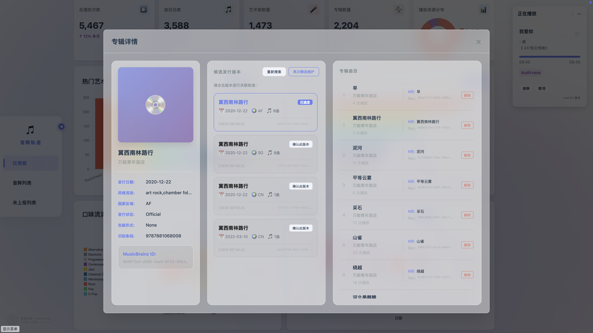
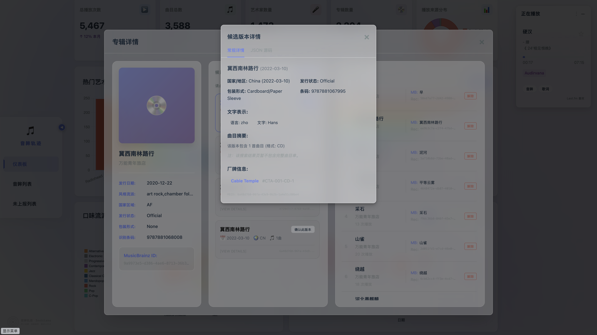
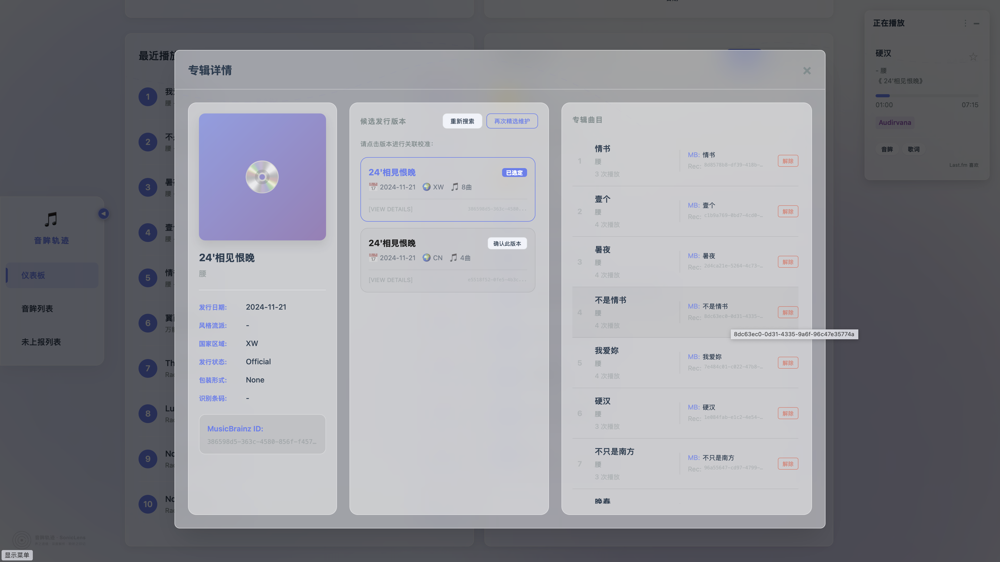
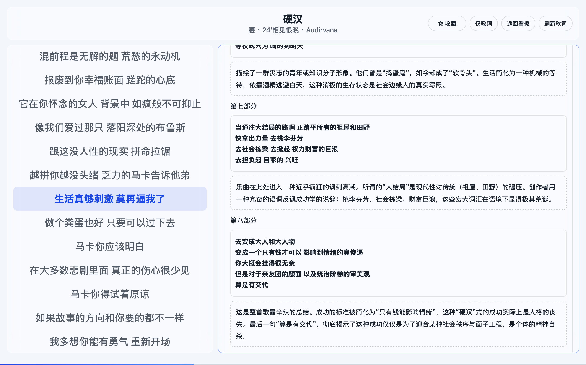

# 专辑管理与 MusicBrainz 深度集成特性清单

## 概述
实现了完整的专辑（Album）生命周期管理，并深度集成 MusicBrainz (MB) 能力，支持专辑元数据的精准补全、曲目轨道号自动校正及可视化详情展示。

## 变更详情

### 1. 数据库模型扩展
- **Album**: 独立存储专辑信息（名称、艺术家、发行日期，流派）。
- **TrackAlbum**: 维护歌曲与专辑的多对多关联，并记录每张专辑内的曲目序号（`track_number`）。
- **ReleaseMB**: 缓存从 MusicBrainz API 搜索到的原始 Release JSON 数据。
- **AlbumReleaseMB**: 记录用户手动确认的本地专辑与 MusicBrainz Release (MBID) 的关联关系。
- **TrackPlayRecord**: 新增 `album_id` 字段，解决同名专辑区分问题。

### 2. 后端逻辑 (MusicBrainz Service)
- **数据归集**: 实现了从现有记录中自动提取并生成专辑档案的初始化逻辑。
- **初选补全**: 实现 `SearchAndCacheReleases`，支持根据专辑名/艺术家搜索 MB 候选发行版。
- **精选维护 (深度维护)**: 实现 `DeepingMaintenance`。获取 MBID 详细元数据后，支持自动同步发行日期、确认曲目列表完整性，并强制校正本地记录的轨道序号。
- **SaveReleaseMB 优化**: 改用 `(mbid, album_id)` 组合索引，解决同名专辑搜索重复问题。

### 3. API 与交互
- **REST API**:
    - `GET /api/albums/:id`: 获取专辑详情及其所有曲目。
    - `GET /api/musicbrainz/search-releases/:album_id`: 触发 MB 搜索。
    - `POST /api/musicbrainz/deep-maintenance/:album_id`: 触发深度同步维护。
    - `POST /api/track-album/unlink`: 解除 TrackAlbum 关联（人工修复用）。
    - `GET /api/track`: 返回 Track 信息时增加 `album_id` 字段。
- **前端增强**:
    - 在仪表盘热门专辑图表点击可直接弹出专辑详情模态框。
    - **样式重构**: 使用 CSS 变量统一亮色/暗色主题，修复之前硬编码颜色问题。
    - **操作按钮**: 详情页新增"初选补全"和"精选维护"交互按钮，打通 MB 同步链路。
    - **歌曲详情跳转**: 歌曲详情页的专辑名可点击跳转至专辑详情模态框。
    - **曲目管理**: 专辑详情中的曲目列表增加"解除"按钮，支持人工修复错误关联。

## 验证结论
- 功能链路：热门图表点击 -> 展示详情 -> 搜索 MB 候选 -> 选定 MBID -> 执行深度维护 -> 轨道序号自动校正。
- UI 表现：专辑详情页排版整齐，适配暗黑/明亮模式及毛玻璃效果。
- 数据一致性：通过 album_id 字段实现同名专辑区分，通过解除关联功能支持人工修复。

## 相关截图
- 
- 
- 
- 
