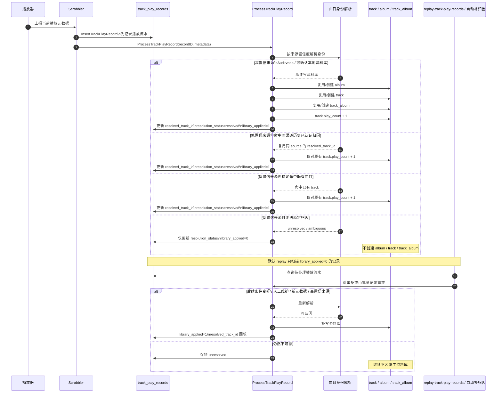
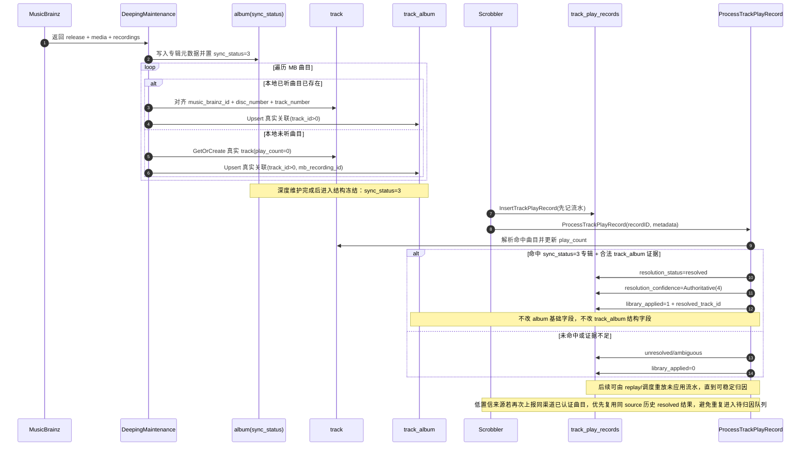
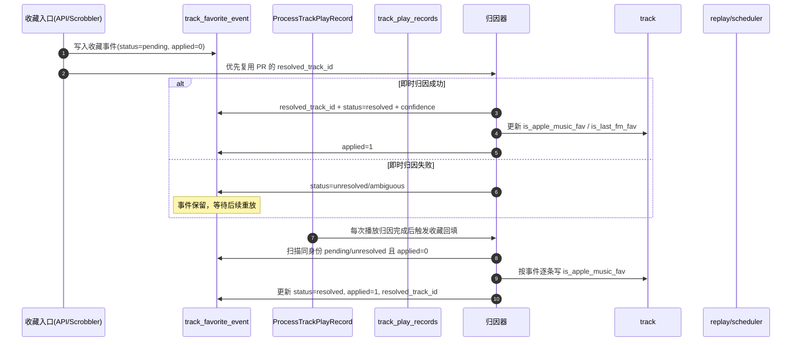
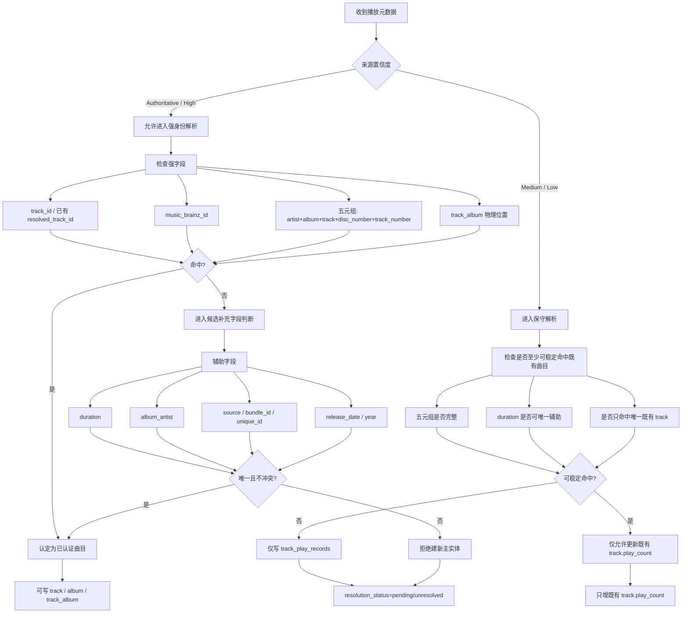
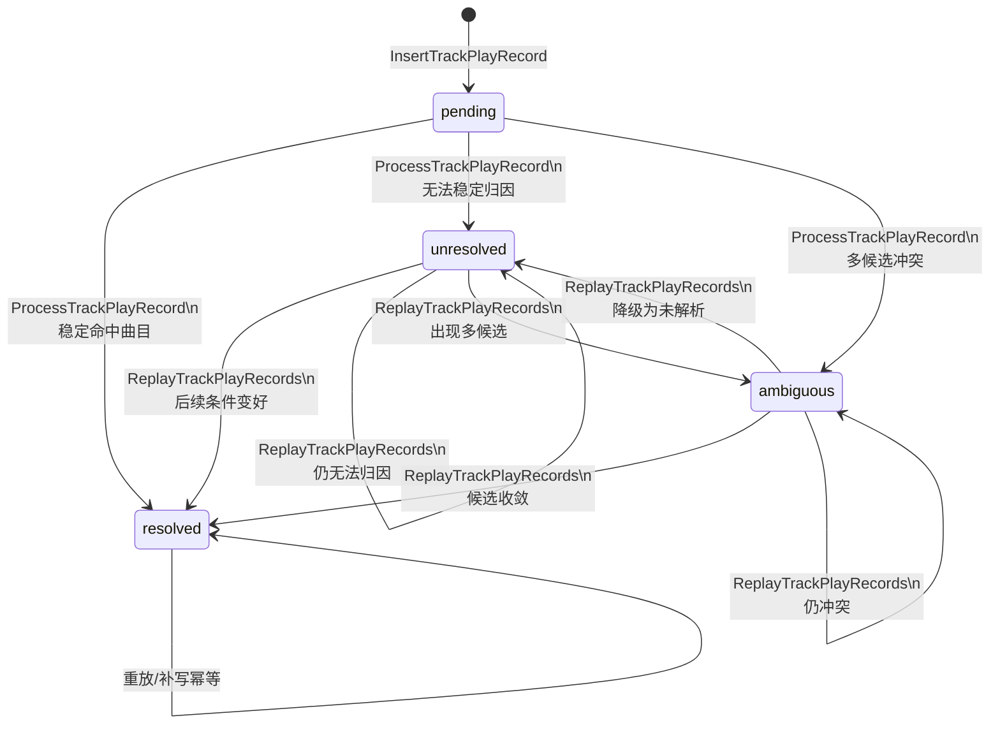

# 播放流水补归因 MySQL 迁移与人工测试清单

## 目标

- 为现网 MySQL 补齐 `track_play_records.library_applied` 字段。
- 在不破坏现有播放链路的前提下，验证 `ProcessTrackPlayRecord`、`ReplayTrackPlayRecords` 和自动补归因调度的行为。
- 在人工联调后再决定是否开启 `playReplay.enabled`。
- 默认从“新播放产生的数据”开始验证，不建议先全量回补历史 `track_play_records`。

## 整体时序图



## 深度维护与播放归因闭环时序图



## 字段状态对照表

### `album` 关键字段

| 阶段 | `sync_status` | `release_date/genre/country/...` | 说明 |
| --- | --- | --- | --- |
| 深度维护前 | `0/1/2` | 可能不完整 | 可能来自播放器弱元数据或初选结果 |
| 深度维护后 | `3` | 已由 MB + 人工确认补全 | 进入权威状态 |
| 播放归因后 | `3` | 保持不变 | 播放链路不再改写基础字段（冻结） |

### `track` 关键字段

| 阶段 | `music_brainz_id` | `disc_number/track_number` | `play_count` | 说明 |
| --- | --- | --- | --- | --- |
| 深度维护前 | 可能为空 | 可能缺失 | 已听曲目>0，未听曲不存在 | 结构不完整 |
| 深度维护后 | 已对齐 MBID | 已对齐物理位置 | 未听曲会被创建为 `0` | 不再依赖 `track_id=0` 占位 |
| 播放归因后 | 不降级 | 不被弱来源覆盖 | 仅增量 +1 | 归因成功后稳定累计 |

### `track_album` 关键字段

| 阶段 | `track_id` | `mb_recording_id` | `disc_number/track_number` | 说明 |
| --- | --- | --- | --- | --- |
| 深度维护前 | 可能存在 `0` 占位 | 可能为空 | 可能不完整 | 历史兼容态 |
| 深度维护后 | 应为 `>0` 真实关联 | 已补齐 | 已补齐 | 专辑结构完成 |
| 播放归因后 | 保持 `>0` | 保持不变 | 保持不变 | `sync_status=3` 下结构冻结 |

### `track_play_records` 关键字段

| 阶段 | `resolved_track_id` | `resolution_status` | `resolution_confidence` | `library_applied` | 说明 |
| --- | --- | --- | --- | --- | --- |
| 写入流水后 | `0` | `pending` | `0` | `0` | 只完成入库 |
| 一次归因后（成功） | `>0` | `resolved` | `1~4` | `1` | 命中稳定曲目 |
| 同渠道历史认证继承 | `>0` | `resolved` | 继承历史值 | `1` | 低置信来源复用同 `source` 历史已认证归因 |
| 一次归因后（失败） | `0` 或旧值 | `unresolved/ambiguous` | `1~3` | `0` | 待 replay 重放 |
| 命中深度维护权威证据 | `>0` | `resolved` | `4` | `1` | 提升为 `Authoritative` |

## 当前流程理解

- 不是所有播放都会进入 `track / album / track_album`。
- 高置信来源播放会进入资料库主实体，并完成主表和关联表写入。
- 低置信来源如果命中“同 `source` 历史已认证流水”，会直接继承该 `resolved_track_id`，同步更新当前流水并直接给既有 `track` 增加播放次数。
- 低置信来源如果只能稳定命中既有 `track`，也会更新既有曲目的 `play_count`，但不会随意新建专辑结构。
- 低置信来源如果无法稳定归因，只会写 `track_play_records`，不会碰 `track / album / track_album`。
- 默认 `replay-track-play-records` 只处理 `library_applied = 0` 的记录，也就是“还没真正应用到资料库”的播放流水。
- 对 `sync_status=3` 专辑，播放链路默认冻结结构写入：不再改 `album` 基础字段，不再改 `track_album` 物理位置和 `mb_recording_id`。

### 同渠道历史认证继承（新增）

- 目标：避免 Apple Music 等弱来源在人工归因完成后，后续重复播放仍不断进入“待归因”队列。
- 当前实现：低置信播放在保守解析前，会先查询 `track_play_records` 中同 `source`、同身份、且 `resolved + library_applied=1` 的历史记录。
- 若命中：
  - 直接复用该 `resolved_track_id`
  - 当前新流水回填 `resolved_track_id / resolution_status / resolution_confidence / library_applied`
  - 同步回填 `music_brainz_id`
  - 仅对既有 `track.play_count` 递增，不新建 `album / track / track_album`
- 约束：历史继承必须按 `source` 过滤，不能跨渠道复用，避免 Apple Music 弱身份误吃到 Audirvana / Roon 的归因结果。

## 收藏事件闭环（阶段 B 已实现）

### 目标

- 收藏入口不再直接建 `track`，避免弱元数据把曲库写脏。
- 收藏状态先入“待归因事件”，等曲目身份稳定后再回填 `track.is_apple_music_fav`。

### 已落地表：`track_favorite_event`

建议字段：

- `id`
- `source`（Apple Music / Last.fm）
- `provider_favorite`（bool）
- `artist / album / track`
- `album_artist`
- `track_number / disc_number`
- `music_brainz_id`
- `duration`
- `bundle_id / unique_id`（弱线索原样保留）
- `resolved_track_id`（默认 0）
- `resolution_status`（`pending/resolved/unresolved/ambiguous`）
- `resolution_confidence`
- `applied`（是否已写入 `track` 收藏字段）
- `created_at / updated_at`

### 收藏归因时序图（已实现）



### 与播放闭环的关系

- 播放闭环负责“把曲目身份稳定下来”。
- 收藏闭环优先复用 `ProcessTrackPlayRecord` 已回填的 `resolved_track_id`，只在身份稳定后落到 `track`。
- 两条闭环共用 `resolved_track_id + resolution_status + resolution_confidence` 语义，便于统一观测和重放。
- 代码层已接入：`ProcessTrackPlayRecord` / `ResolveTrackPlayRecord` 在完成曲目归因后，会调用收藏事件回填。

### 关键交互约束

- 收藏链路不应绕开 `ProcessTrackPlayRecord` 自行实现一套宽松归因。
- 当同一时刻有播放事件时，先跑 `ProcessTrackPlayRecord`，再处理收藏事件回填。
- 收藏重放任务应先查 `track_play_records` 中最新 `resolved` 结果，再决定是否更新 `track` 收藏字段。
- 当前 `SetAppleMusicFavorite` / `SetLastFmFavorite` 已改为“事件优先”：不再因收藏动作新建 `track`，仅在成功解析后更新既有收藏字段。
- 当前 `SetAppleMusicFavorite` / `SetLastFmFavorite` 新增“稳态短路”：若曲目已稳定归因，且目标收藏状态与 `track` 当前状态一致，则直接 no-op，不再新增 `track_favorite_event`。
- `SetTrackFavorite` 已收敛为统一入口：复用同一份参数对象，Apple Music 来源触发 Apple+Last.fm 双写，其它来源仅写 Last.fm，并返回聚合错误。
- 收藏事件新增“开放事件幂等复用”：同 `source + provider_favorite + identity(artist/album/track/disc/track)` 的 `pending/unresolved + applied=0` 不再重复插入新行。
- `trackLikeCheckAndHandle` 已改为“仅在曲目切换或收藏状态探测变化时触发写入”，并在写入前加 Redis 10 秒分布式锁 + double-check，避免并发轮询下重复写。
- Apple Music 播放器侧的喜欢同步已统一改为通过 `SetTrackFavorite` 编排 Apple/Last.fm 双写，避免 scrobbler 层分散调用 `SetAppleMusicFavorite` / `SetLastFmFavorite` 导致同一轮检查重复插 event。
- `track_favorite_event` 的当前定位更接近“待归因 / 待应用上下文事件”，而不是无限增长的收藏操作审计表；对已 `resolved + applied=1` 且目标状态未变化的情况，不再重复插入新的 resolved event。

## 曲目身份认证检查图



## 身份字段分级

### 强身份字段

- `track.id`
- `resolved_track_id`
- `music_brainz_id`
- 五元组：`artist + album + track + disc_number + track_number`
- `track_album` 的物理位置绑定

### 弱辅助字段

- `duration`
- `album_artist`
- `source`
- `bundle_id`
- `unique_id`
- `release_date`
- `year`

### 明确不能再当主键使用的字段

- `unique_id`
- `source`
- `bundle_id`
- `release_date`
- `year`

这些字段只能作为线索，不能单独决定“这是同一首歌”。

## 来源置信度枚举

- `TrackMetadataConfidenceAuthoritative`
  最高可信，允许驱动资料库修正
- `TrackMetadataConfidenceHigh`
  高可信，允许新建或补全 `track / album / track_album`
- `TrackMetadataConfidenceMedium`
  只适合辅助命中既有曲目，不适合随意建专辑结构
- `TrackMetadataConfidenceLow`
  只适合播放观测和保守归因，不能写坏主资料库

## 当前匹配顺序

1. `resolved_track_id / track.id`
2. 同 `source` 历史已认证 `track_play_records.resolved_track_id`
3. `music_brainz_id`
4. 五元组精确命中
5. `duration` 唯一辅助命中
6. 受限的既有曲目命中

不会再做的事情：

- 不会再按 `unique_id` 全局直连
- 不会再默认按 `artist + album + track` 取第一条
- 不会再让 `release_date / year` 参与专辑主身份判断

## 归因字段说明与状态图

### `resolution_status` 枚举含义

- `pending`
  播放流水已写入，但这条记录还没完成一次有效归因处理。
- `resolved`
  已归因到稳定曲目，`resolved_track_id > 0`。
- `unresolved`
  本轮尝试后仍不能稳定落到单曲目，可后续重放重试。
- `ambiguous`
  存在多个候选，系统主动拒绝“拍脑袋”绑定。

### `resolution_confidence` 含义

- `0`
  尚未执行有效归因，或历史数据未填值。
- `1`
  `TrackMetadataConfidenceLow`，低置信来源观测态。
- `2`
  `TrackMetadataConfidenceMedium`，可辅助命中既有曲目。
- `3`
  `TrackMetadataConfidenceHigh`，可参与稳定实体写入。
- `4`
  `TrackMetadataConfidenceAuthoritative`，权威维护来源。

`TrackMetadataConfidenceAuthoritative` 当前触发条件：

- 已稳定归因到 `resolved_track_id`；
- 该曲目存在 `track_album` 绑定到 `sync_status = 3` 的专辑；
- 且该绑定具备合法证据：`mb_recording_id` 非空，或 `disc_number + track_number` 物理位置有效。

### `library_applied` 含义

- `0`
  这条播放还没有被“应用到主资料库”(track/album/track_album)。
- `1`
  这条播放已完成主资料库写入，或已被历史封板归档出默认 replay 队列。

### 归因状态迁移图



### `track_favorite_event` 状态说明

- `resolution_status=pending`
  收藏事件已写入，尚未完成一次有效归因。
- `resolution_status=resolved`
  已稳定归因到 `resolved_track_id`，并可写 `track.is_apple_music_fav`。
- `resolution_status=unresolved`
  本轮无法稳定归因，等待后续播放归因或重试。
- `resolution_status=ambiguous`
  候选冲突，系统拒绝盲写。
- `applied=0`
  收藏尚未回填到 `track`。
- `applied=1`
  收藏已回填到 `track`（幂等可重复执行）。

### 收藏稳态 no-op 规则（新增）

- 若某首曲目已经稳定归因到 `track`，且目标收藏状态已经等于 `track.is_apple_music_fav / is_last_fm_fav` 当前值：
  - 直接返回成功
  - 不再插入新的 `track_favorite_event`
- 因此 `track_favorite_event` 的新增应主要集中在：
  - 曲目尚未稳定归因
  - 或目标收藏状态与当前主表状态不一致，需要一次真实回填

## 策略原则

- `track_play_records` 是播放流水，不是主资料库实体。
- `sync_status=3` 的深度维护专辑在补全未听曲目时应直接实体化到 `track`（`play_count=0`），并写入真实 `track_album.track_id`，不再继续沉淀 `track_id=0` 占位。
- 历史流水包含旧逻辑时期留下的弱来源和低质量元数据，不值得一开始就全量维护。
- 当前阶段的重点是验证“从现在开始的新播放”是否还能继续写坏 `album / track / track_album`。
- 因此 rollout 建议是：
  - 先迁移表结构；
  - 从新播放数据开始观察；
  - 只在必要时按来源、时间窗口或指定记录补 replay；
  - 不做全历史一把梭的回补。

## 一、MySQL 迁移 SQL

本轮播放归因改造涉及 `track_play_records` 新增字段：

- `resolved_track_id`
- `resolution_status`
- `resolution_confidence`
- `library_applied`

如果现网还没补过前几轮字段，建议按下面顺序确认并补齐。

### 1. 检查字段是否存在

```sql
SHOW COLUMNS FROM track_play_records LIKE 'resolved_track_id';
SHOW COLUMNS FROM track_play_records LIKE 'resolution_status';
SHOW COLUMNS FROM track_play_records LIKE 'resolution_confidence';
SHOW COLUMNS FROM track_play_records LIKE 'library_applied';
```

### 2. 缺什么补什么

补 `resolved_track_id`：

```sql
ALTER TABLE track_play_records
ADD COLUMN resolved_track_id BIGINT NOT NULL DEFAULT 0 AFTER source;
```

补 `resolution_status`：

```sql
ALTER TABLE track_play_records
ADD COLUMN resolution_status VARCHAR(32) NOT NULL DEFAULT 'pending' AFTER resolved_track_id;
```

补 `resolution_confidence`：

```sql
ALTER TABLE track_play_records
ADD COLUMN resolution_confidence TINYINT NOT NULL DEFAULT 0 AFTER resolution_status;
```

补 `library_applied`：

```sql
ALTER TABLE track_play_records
ADD COLUMN library_applied TINYINT(1) NOT NULL DEFAULT 0 AFTER resolution_confidence;
```

### 3. 补索引

补 `resolved_track_id` 索引：

```sql
ALTER TABLE track_play_records
ADD INDEX idx_track_play_records_resolved_track_id (resolved_track_id);
```

补 `resolution_status` 索引：

```sql
ALTER TABLE track_play_records
ADD INDEX idx_track_play_records_resolution_status (resolution_status);
```

补 `library_applied` 索引：

```sql
ALTER TABLE track_play_records
ADD INDEX idx_track_play_records_library_applied (library_applied);
```

### 4. 一次性补齐版本

如果你确认现网这四个字段都还没有，可以直接一次执行：

```sql
ALTER TABLE track_play_records
ADD COLUMN resolved_track_id BIGINT NOT NULL DEFAULT 0 AFTER source,
ADD COLUMN resolution_status VARCHAR(32) NOT NULL DEFAULT 'pending' AFTER resolved_track_id,
ADD COLUMN resolution_confidence TINYINT NOT NULL DEFAULT 0 AFTER resolution_status,
ADD COLUMN library_applied TINYINT(1) NOT NULL DEFAULT 0 AFTER resolution_confidence,
ADD INDEX idx_track_play_records_resolved_track_id (resolved_track_id),
ADD INDEX idx_track_play_records_resolution_status (resolution_status),
ADD INDEX idx_track_play_records_library_applied (library_applied);
```

### 5. 最终确认结构

```sql
SHOW CREATE TABLE track_play_records;
```

### 6. 收藏事件表（新增）

若现网尚未建表，执行：

```sql
CREATE TABLE `track_favorite_event` (
  `id` BIGINT NOT NULL AUTO_INCREMENT,
  `source` VARCHAR(64) NOT NULL,
  `provider_favorite` TINYINT(1) NOT NULL DEFAULT 0,
  `artist` VARCHAR(255) NOT NULL,
  `album` VARCHAR(255) NOT NULL,
  `track` VARCHAR(255) NOT NULL,
  `album_artist` VARCHAR(255) DEFAULT NULL,
  `track_number` TINYINT DEFAULT NULL,
  `disc_number` TINYINT DEFAULT 1,
  `music_brainz_id` VARCHAR(255) DEFAULT NULL,
  `duration` BIGINT DEFAULT NULL,
  `bundle_id` VARCHAR(255) DEFAULT NULL,
  `unique_id` VARCHAR(255) DEFAULT NULL,
  `resolved_track_id` BIGINT DEFAULT 0,
  `resolution_status` VARCHAR(32) NOT NULL DEFAULT 'pending',
  `resolution_confidence` TINYINT DEFAULT 0,
  `applied` TINYINT(1) NOT NULL DEFAULT 0,
  `created_at` TIMESTAMP NULL DEFAULT CURRENT_TIMESTAMP,
  `updated_at` TIMESTAMP NULL DEFAULT CURRENT_TIMESTAMP ON UPDATE CURRENT_TIMESTAMP,
  PRIMARY KEY (`id`),
  KEY `idx_tfe_source` (`source`),
  KEY `idx_tfe_identity` (`artist`, `album`, `track`, `track_number`, `disc_number`),
  KEY `idx_tfe_resolved_track_id` (`resolved_track_id`),
  KEY `idx_tfe_resolution_status` (`resolution_status`),
  KEY `idx_tfe_applied` (`applied`)
) ENGINE=InnoDB DEFAULT CHARSET=utf8mb4 COLLATE=utf8mb4_unicode_ci;
```

## 二、上线前建议配置

建议先关闭自动补归因：

```yaml
playReplay:
  enabled: false
  intervalMinutes: 60
  batchSize: 20
  onlyUnapplied: true
  onlyUnresolved: false
  runOnStartup: false
```

说明：

- `enabled: false`
  先靠手动命令验数，避免自动调度直接影响现网。
- `onlyUnapplied: true`
  第一阶段优先补“还没应用到资料库”的播放流水。
- `onlyUnresolved: false`
  避免一开始把所有未解析历史都卷进来。

## 三、推荐执行顺序

### 阶段 1：只迁移，不回补历史

先完成表结构迁移，不执行全量 replay。

如果你已经明确“只从新播放开始验证”，建议在迁移后立刻做一次历史流水封板，把旧记录从 replay 队列中归档出去。

先统计将被封板的旧记录数量：

```sql
SELECT COUNT(*) AS old_records
FROM track_play_records
WHERE play_time < '2026-03-15 23:30:00'
  AND (library_applied = 0 OR resolution_status = 'pending');
```

再执行封板：

```sql
UPDATE track_play_records
SET
  library_applied = 1,
  resolution_status = CASE
    WHEN resolution_status = 'pending' THEN 'unresolved'
    ELSE resolution_status
  END
WHERE play_time < '2026-03-15 23:30:00'
  AND (library_applied = 0 OR resolution_status = 'pending');
```

说明：

- `library_applied = 1`
  表示这些旧流水不再参与新的资料库补写流程。
- `pending -> unresolved`
  表示这些历史记录保留为“未解析历史流水”，而不是继续冒充待处理新任务。
- 封板完成后，默认 `replay-track-play-records --limit 20` 不会再扫出这批历史记录。
- 这里的时间点应改成你正式切换新流程的真实时间。

### 阶段 2：从新播放开始观察

在迁移完成后，先用真实播放器制造新的播放记录，再看新链路是否正常：

- Audirvana 高置信新曲
- Apple Music 本地资料库曲目
- Apple Music 流媒体
- Roon 简化播放态

这个阶段的目标不是清理旧数据，而是确认“从现在开始”数据不再继续污染资料库。

### 阶段 3：只按需 replay 小窗口数据

如果需要 replay，建议只处理：

- 指定 `id`
- 指定来源
- 最近几小时或几天

不要一开始就跑全历史。

注意当前脚本默认行为：

- `replay-track-play-records` 默认只扫描 `library_applied = 0` 的记录。
- 已经封板成 `library_applied = 1` 的历史流水，即使 `resolution_status = unresolved`，默认也不会再进入 replay 队列。
- 只有显式传 `--only-unresolved`，才会把 `pending / unresolved` 的记录也拉进来。

先看候选规模：

```bash
go run . -c config/config_dev.yaml replay-track-play-records --limit 20
```

说明：

- 这条默认命令现在更适合“看新流程里还没应用到资料库的记录”。
- 如果你已经执行过历史封板 SQL，旧的 `unresolved + library_applied = 1` 记录不会再出现在这里。

只跑高置信来源做首轮验证：

```bash
go run . -c config/config_dev.yaml replay-track-play-records --source "Audirvana" --limit 20
go run . -c config/config_dev.yaml replay-track-play-records --apply --source "Audirvana" --limit 20
```

如果你确实要看历史未解析流水，再显式使用：

```bash
go run . -c config/config_dev.yaml replay-track-play-records --only-unresolved --limit 20
```

再跑最近的小批量未应用记录：

```bash
go run . -c config/config_dev.yaml replay-track-play-records --only-unapplied --limit 20
go run . -c config/config_dev.yaml replay-track-play-records --apply --only-unapplied --limit 20
```

需要精准验证单条流水时：

```bash
go run . -c config/config_dev.yaml replay-track-play-records --id 12345
go run . -c config/config_dev.yaml replay-track-play-records --apply --id 12345
```

需要按时间窗口验证时：

```bash
go run . -c config/config_dev.yaml replay-track-play-records \
  --apply \
  --played-from 2026-03-01T00:00:00+08:00 \
  --played-to 2026-03-15T23:59:59+08:00 \
  --limit 50
```

## 四、验数 SQL

### 1. 看整体状态分布

```sql
SELECT resolution_status, library_applied, COUNT(*) AS c
FROM track_play_records
GROUP BY resolution_status, library_applied
ORDER BY resolution_status, library_applied;
```

### 2. 看当前待 replay 的记录量

```sql
SELECT COUNT(*) AS replayable
FROM track_play_records
WHERE library_applied = 0;
```

说明：

- 这个数字大不代表必须立刻清零。
- 对现阶段更重要的是“新产生的数据是否被正确处理”，而不是“历史 backlog 是否一次清完”。
- 如果你要看历史未解析 backlog，请单独统计：

```sql
SELECT COUNT(*) AS unresolved_backlog
FROM track_play_records
WHERE resolution_status IN ('pending', 'unresolved');
```

### 3. 看最近待处理样本

```sql
SELECT id, source, artist, album, track, track_number, disc_number,
       resolution_status, library_applied, resolved_track_id, play_time
FROM track_play_records
WHERE library_applied = 0
ORDER BY play_time DESC
LIMIT 50;
```

如果你要看历史未解析流水样本，再单独执行：

```sql
SELECT id, source, artist, album, track, track_number, disc_number,
       resolution_status, library_applied, resolved_track_id, play_time
FROM track_play_records
WHERE resolution_status IN ('pending', 'unresolved')
ORDER BY play_time DESC
LIMIT 50;
```

### 4. 看 replay 后是否逐日收敛

```sql
SELECT DATE(play_time) AS d,
       SUM(CASE WHEN library_applied = 0 THEN 1 ELSE 0 END) AS unapplied,
       SUM(CASE WHEN resolution_status IN ('pending', 'unresolved') THEN 1 ELSE 0 END) AS unresolved
FROM track_play_records
GROUP BY DATE(play_time)
ORDER BY d DESC
LIMIT 14;
```

### 5. 看是否异常生成了过多实体

```sql
SELECT COUNT(*) AS tracks FROM track;
SELECT COUNT(*) AS albums FROM album;
SELECT COUNT(*) AS track_albums FROM track_album;
```

建议每跑完一批 `--apply` 就重新执行一次上面 1 到 5。

## 五、人工测试场景

### 场景 A：Audirvana 高置信新曲

目标：

- 新播放应生成 `track_play_record`
- 应创建或复用正确的 `album`
- 应创建或复用正确的 `track`
- 应建立正确 `track_album`
- `library_applied = 1`
- `resolution_status = resolved`

建议核对：

```sql
SELECT * FROM track_play_records ORDER BY id DESC LIMIT 5;
SELECT * FROM track ORDER BY id DESC LIMIT 5;
SELECT * FROM album ORDER BY id DESC LIMIT 5;
SELECT * FROM track_album ORDER BY id DESC LIMIT 10;
```

### 场景 B：Apple Music 本地资料库曲目

目标：

- 允许命中既有曲目并增加播放
- 不应因为弱字段差异新拆出重复专辑

重点观察：

- `album.release_date` 是否被误改
- `track_album` 是否新增错误位置绑定

### 场景 C：Apple Music 流媒体

目标：

- 应记录 `track_play_record`
- 如果不能稳定归因，不应直接创建 `album / track_album`
- 回放后也应保持保守，不因 `year` 或弱 `releaseDate` 写坏专辑结构

重点观察：

- `library_applied` 可能仍为 `0`
- `resolution_status` 可能为 `pending/unresolved`
- 这属于预期，不是故障

### 场景 D：Roon / media-control

目标：

- 应记录播放流水
- 信息不足时只做保守归因
- 不应凭 `uniqueIdentifier` 直接串到错误曲目

## 六、开启自动补归因前的通过标准

满足以下条件再开启 `playReplay.enabled`：

- 新产生的播放记录中，`library_applied = 0` 没有异常堆积。
- 新产生的播放记录中，`resolution_status` 分布符合来源预期：
  - Audirvana 应以 `resolved` 为主；
  - Apple Music 流媒体允许存在 `pending/unresolved`。
- 连续几批小范围手动 `--apply` 后，目标窗口内的 `library_applied = 0` 数量下降。
- 没有观察到 `album`、`track_album` 异常增长。
- Apple Music 流媒体没有重新制造重复专辑。
- Audirvana 与 Apple Music 本地资料库的高置信场景都能稳定归因。

## 七、开启自动补归因后的建议值

初始建议：

```yaml
playReplay:
  enabled: true
  intervalMinutes: 60
  batchSize: 20
  onlyUnapplied: true
  onlyUnresolved: false
  runOnStartup: false
```

观察稳定后再逐步提高：

- `batchSize` 从 `20` 提到 `50`
- 如果历史 backlog 很大，再考虑 `runOnStartup: true`

## 八、当前阶段结论

当前代码状态已经接近“可进入 MySQL 维护与人工联调”：

- 实时播放链路已统一收口到 `ProcessTrackPlayRecord`
- 手动补归因命令已可用
- 自动补归因调度已可配置启用

剩余工作主要是：

- 现网表结构迁移
- 从新播放开始人工联调
- 按需 replay 小窗口验数
- 人工联调确认来源差异行为
