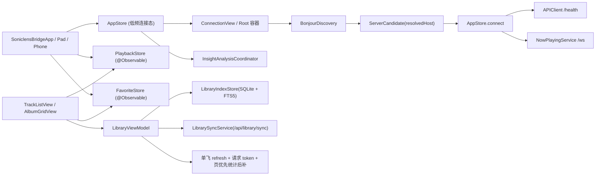

# Bridge 性能治理与连接链路收敛特性清单

## 日期

- 2026-03-31

## 特性摘要

- `soniclens-bridge` 完成一轮围绕“高频状态广播、资料库首开与筛选卡顿、Bonjour 连接反馈迟缓、Now Playing / 首页热区成本”的共享层性能治理。
- 本轮目标不是单页视觉微调，而是把三端共同受影响的重复工作从架构层移除：高频状态切片、资料库 single-flight、SQLite 索引升级、连接阶段模型、共享网络会话、播放页并行请求与背景降本。

## 本次闭环范围

### 1. 高频状态切片与 Observation 收口

- `AppStore` 不再直接作为高频播放态 / 收藏态的广播源。
- 新增 `PlaybackStore` 与 `FavoriteStore`，并通过 `@Observable` + typed environment 注入三端入口。
- 密集列表、播放条、详情页改为按需读取 `PlaybackStore` / `FavoriteStore` 的派生字段，避免 `AppStore` 上的广域重绘。

### 2. 资料库首开与刷新链路治理

- `LibraryViewModel` 的资料库刷新改为 single-flight，前后台、WS 通知、切服务端不会再同时扇出多轮同步。
- 专辑/曲目列表改为“第一页先返回，总数异步补”，控制区不再被 `count -> query` 串行链路阻塞。
- 专辑与曲目列表都新增请求 token；快速切换排序 / 筛选 / 搜索时，旧结果不会覆盖新条件结果。
- 收藏变更对普通曲目页优先做可见行 patch，不再默认整页 reload。

### 3. 本地索引与查询结构升级

- `LibraryIndexStore.syncSchemaVersion` 升级到 `7`。
- `track_index` 新增物化列 `is_favorited_effective`，统一收藏筛选语义。
- 新增 favorites / unreported / recent 相关复合索引，避免 `OR` 全表扫和临时 B-Tree 排序。
- 收藏相关统计与筛选统一改走 `is_favorited_effective = 1`。

### 4. 连接链路可见性与真实耗时收敛

- 连接状态细化为 `idle / resolving / healthCheck / establishingRealtime / connected / failed / cancelled`。
- 连接页与行内按钮会同步展示阶段反馈，重复点击支持取消。
- Bonjour 候选现在会保留已解析地址，优先用解析出的 IP 直连，减少 `.local` 名称在健康检查阶段重复解析带来的等待。
- 三端主界面工具栏新增全局断开入口，允许用户显式回到连接流程。

### 5. 正在播放 / 首页热区降本

- `APIClient` 默认复用共享 `URLSession`，不再实例级创建独立 session。
- `PlayerViewModel.load` 改为并行拉取歌词与 insight，并丢弃过期任务结果。
- `NowPlaying` 与首页背景默认收敛动态层数、blur 半径与常驻视觉成本；iPhone 优先使用更轻量的背景策略。

## 架构关系图

## 验证与证据

- 命令行构建已通过：
  - `xcodebuild -project soniclens-bridge/SoniclensBridge.xcodeproj -scheme SoniclensBridgeMac -configuration Debug -sdk macosx build CODE_SIGNING_ALLOWED=NO`
  - `xcodebuild -project soniclens-bridge/SoniclensBridge.xcodeproj -scheme SoniclensBridgePhone -configuration Debug -destination 'generic/platform=iOS' build CODE_SIGNING_ALLOWED=NO`
- 本地 `EXPLAIN QUERY PLAN` 已确认：
  - favorites 统计命中 `is_favorited_effective` 索引
  - `is_reported = 0 ORDER BY created_at DESC, id DESC` 命中复合索引
  - favorites + updated 排序命中复合索引

## 长期约束清单

- Bridge 高密度列表禁止直接订阅 `AppStore` 的高频字段；必须优先消费细粒度 `PlaybackStore` / `FavoriteStore` 或容器派生值。
- 资料库刷新必须保持 single-flight；页面进入、回前台、WS 增量通知只能合并，不能并发扇出。
- 资料库列表必须保持“第一页先返回，总数异步补”的交互策略；控制区和标题反馈优先级高于统计完成。
- 收藏筛选语义以 `is_favorited_effective` 为准，不允许回退到 `apple_music OR lastfm` 的运行时条件拼接。
- Bonjour 自动发现若已拿到解析地址，连接链路必须优先直连解析地址；连接中必须有阶段文案、可取消、可断开。
- 动态背景、模糊材质、阴影和常驻动画必须提供性能模式或紧凑策略，尤其是 iPhone 和长驻页面。

## 当前未闭环项

- iPhone 中文九宫格搜索输入在组合态下仍有卡顿风险；此前的自定义输入桥接方案已回滚，当前问题仍作为后续专项处理，不计入本次已闭环能力。
