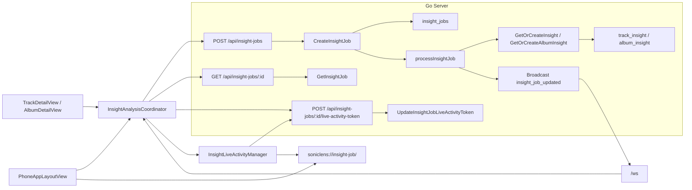
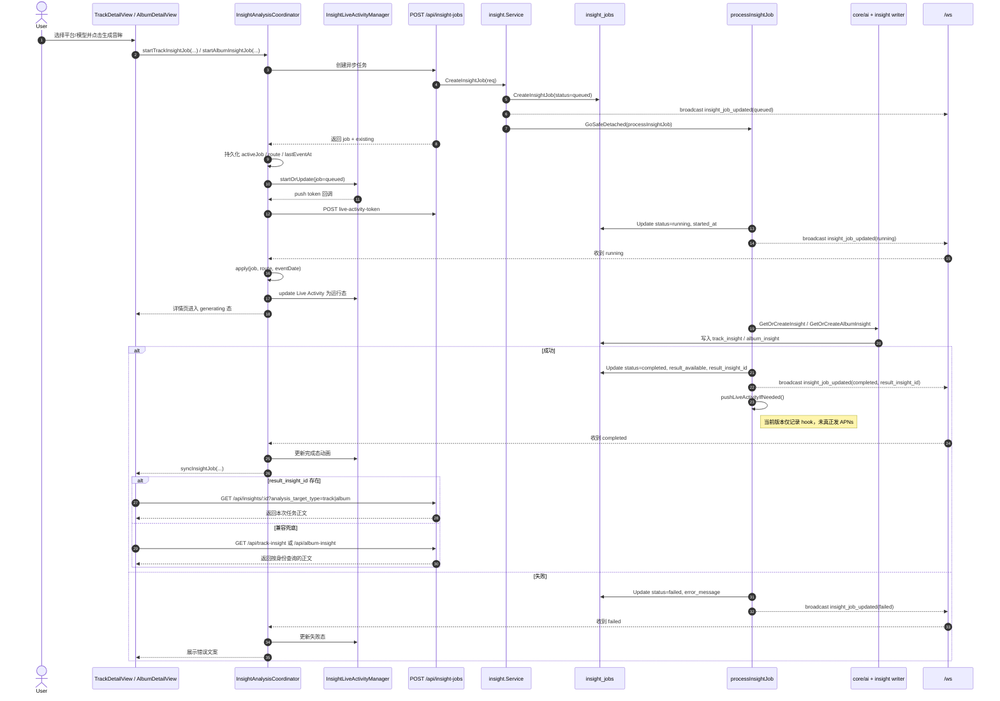
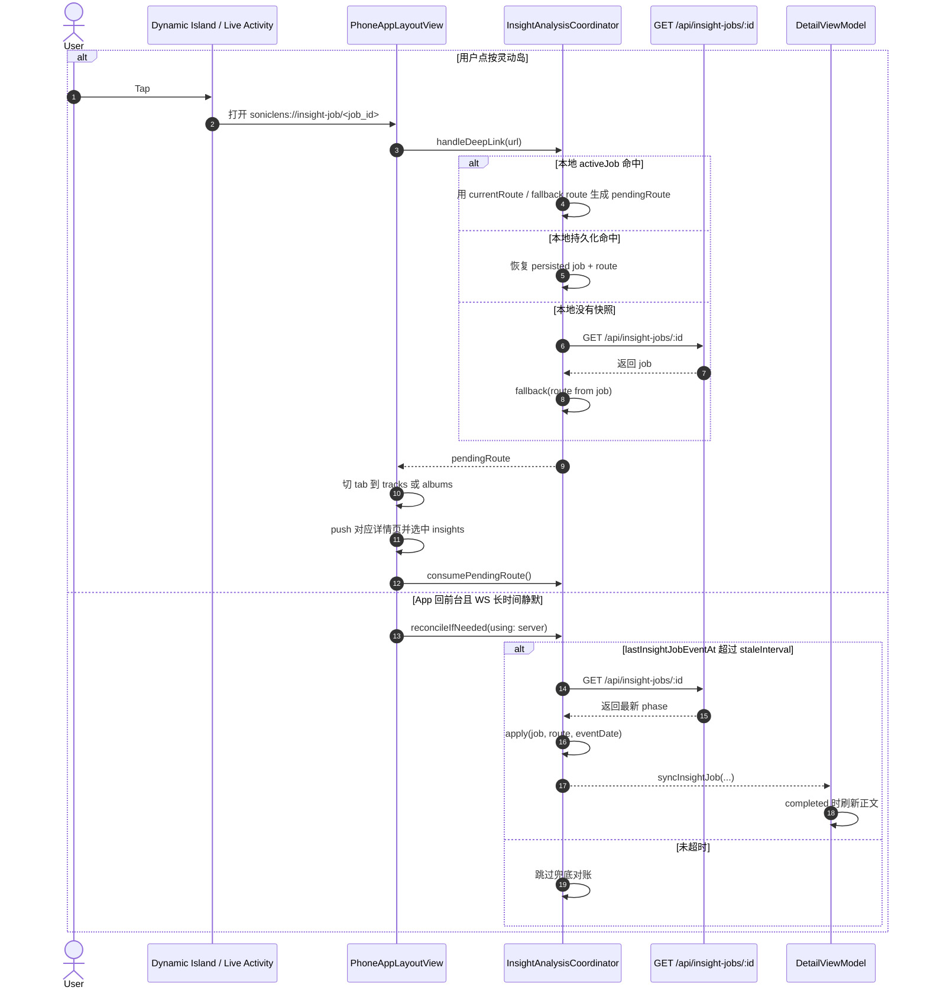
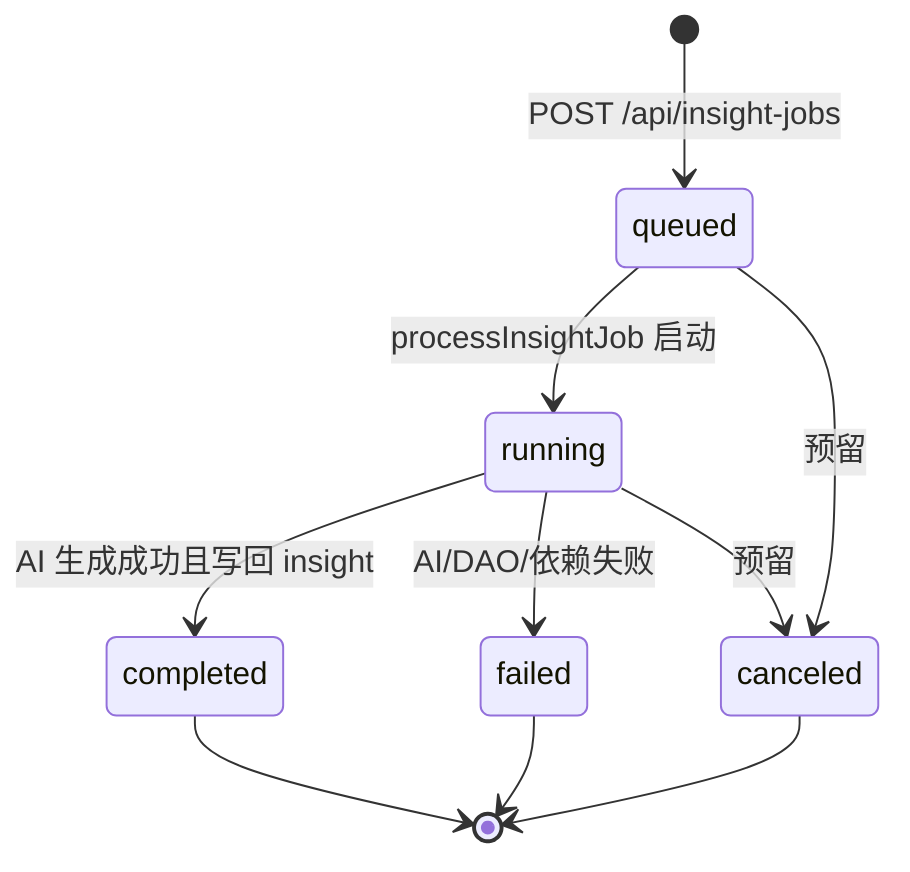
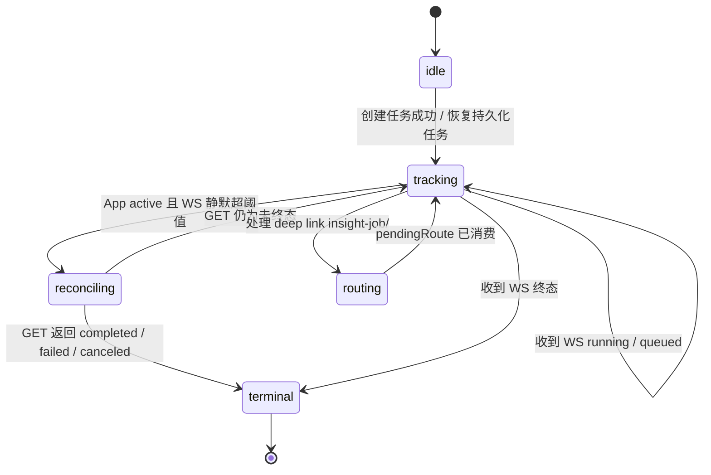
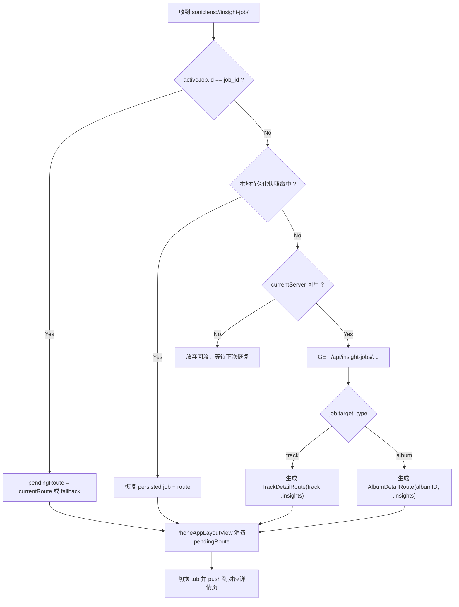
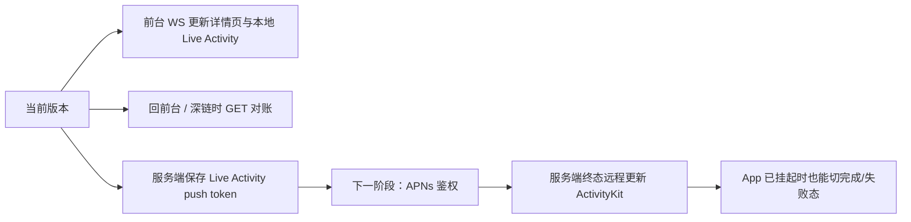

# iPhone 音眸灵动岛与 WS/任务混合闭环特性清单

## 日期

- 2026-03-31

## 特性摘要

- iPhone 音眸分析改为异步任务链路，新增统一 `/api/insight-jobs*` 接口、`insight_job_updated` WebSocket 事件，以及 Bridge 侧 `InsightAnalysisCoordinator`，让曲目/专辑长分析在前台走 WS、回前台走短 GET 对账、iPhone 侧走 Live Activity / 灵动岛展示和深链回流。
- 任务终态新增 `result_insight_id` 闭环，Bridge 详情页优先按 `/api/insights/:id?analysis_target_type=...` 读取本次任务结果，缺失时才回退对象身份查询。

## 架构关系图

## 完整交互时序图

## 深链回流与恢复兜底时序图

## 状态图

### 任务状态图

### 客户端协调层状态图

## 路由回流决策图

## 后端闭环

- 新增 `common.InsightJobPhase` 与 `internal/model/InsightJob`，统一承载曲目/专辑音眸任务状态、目标摘要、平台/模型、终态时间、`live_activity_push_token` 与 `result_insight_id`。
- `internal/model/init.go` 与 `schema_insight_job.go` 已接入建表/补列，SQLite 与 MySQL 初始化都能自动兜底。
- `internal/logic/insight` 新增：
  - `CreateInsightJob`
  - `GetInsightJob`
  - `UpdateInsightJobLiveActivityToken`
  - 后台 `processInsightJob`
- 任务创建后立即广播 `insight_job_updated(queued)`，后台执行时广播 `running/completed/failed`，并最终复用原有 `GetOrCreateInsight/GetOrCreateAlbumInsight` 写回 `track_insight/album_insight`，终态尽量把本次命中的 `result_insight_id` 一起带回。
- 新增 API：
  - `POST /api/insight-jobs`
  - `GET /api/insight-jobs/:id`
  - `POST /api/insight-jobs/:id/live-activity-token`

## Bridge / iPhone 闭环

- `AppStore` 新增全局 `InsightAnalysisCoordinator`，统一管理：
  - 当前活跃任务
  - 最近一次 WS 事件时间
  - 本地持久化快照
  - 深链待回流路由
- `TrackDetailViewModel` / `AlbumDetailViewModel` 不再直接持有 20 分钟长 `POST`；确认模型后转为创建异步任务，并在任务终态时优先按 `result_insight_id` 刷新 `/api/insights/:id`，缺失时才回退旧的身份读取接口。
- `InsightLiveActivityManager` 创建 Live Activity 时优先请求 `pushType: .token`；若真机因未开 Push capability 或系统限制导致失败，会自动降级为本地 Live Activity，先保证灵动岛展示，不阻塞后续 APNs 远程更新能力单独接入。
- `PhoneAppLayoutView` 新增 `soniclens://insight-job/<job_id>` 深链处理，点按灵动岛后能自动切回曲目或专辑详情页的“音眸”Tab。
- `TrackDetailView` 新增 `trackDetailDestination(track:selectedTab:)`，与专辑详情保持一致的路由入口。

## Live Activity / 灵动岛

- 新增 `soniclens-bridge/SoniclensActivities/` Widget Extension 源码与 `SoniclensActivities` target。
- `SoniclensBridgePhone` 已嵌入 `SoniclensActivities.appex`，主 App 构建会同时产出并复制扩展到 `PlugIns/`。
- 新增 `InsightLiveActivityAttributes` 与 `InsightLiveActivityManager`：
  - 运行中展示标题、艺人、专辑、平台、模型与状态
  - 终态按完成 3 分钟、失败/取消 45 秒收口
  - 本地会自动上报 Activity push token 到服务端
- `SoniclensBridge/Info.plist` 已开启 `NSSupportsLiveActivities`，并注册 `soniclens://` URL scheme。
- `soniclens-bridge/SoniclensBridge.xcodeproj` 由 `soniclens-bridge/project.yml` 通过 `xcodegen generate` 生成；后续任何 Live Activity target、plist 属性或 extension 嵌入关系的调整，都必须以 `project.yml` 为真源，否则重新生成工程会覆盖手改。
- 排障经验：若真机日志出现 `Target does not include NSSupportsLiveActivities plist key`，先确认安装包主 App 的 `Info.plist` 已带该键；若任务、WS、结果都正常但灵动岛仍不出现，再检查安装包内是否真实存在 `PlugIns/SoniclensActivities.appex`，避免只补了源码却没把 extension target 嵌入工程。

## 当前限制

- 服务端 APNs Live Activity 远程推送仍是占位 hook：后端已经保存 token 并在终态触发 `pushLiveActivityIfNeeded`，但当前版本尚未真正向苹果推送终态更新。
- 因此，当前可用能力是：
  - 前台：WS 实时驱动详情页与本地 Live Activity 更新
  - 回前台 / 深链回流：GET 对账恢复任务状态
  - 后台“服务端直接把终态推到岛上”还需后续补 APNs 鉴权与发送链路
- 客户端当前按 v1 设计只维护一个活跃音眸任务。

## 后续扩展图

## 验证

- `go test ./api ./internal/logic/insight`
- `xcodebuild -project soniclens-bridge/SoniclensBridge.xcodeproj -scheme SoniclensBridgePhone -destination 'generic/platform=iOS Simulator' build`
- `xcodebuild -project soniclens-bridge/SoniclensBridge.xcodeproj -scheme SoniclensBridgeMac -destination 'generic/platform=macOS' build`
- `xcodebuild -project soniclens-bridge/SoniclensBridge.xcodeproj -scheme SoniclensBridgePad -destination 'generic/platform=iOS Simulator' build`
