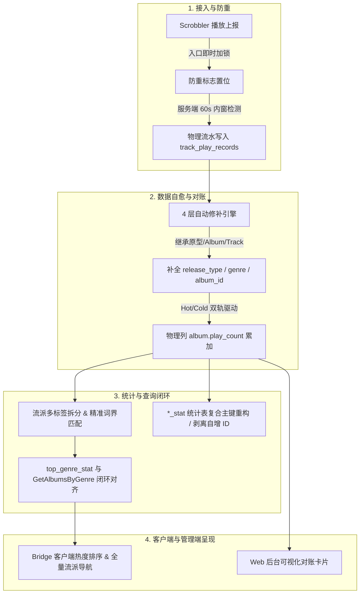

# 2026-08-13 每日架构演进与特性聚合清单

- **日期**: 2026-08-13
- **聚合主题**: 播放事实源归一 (SST)、统计与流派全链路闭环对账、数据自愈修补引擎与高并发/表结构稳定性治理

---

## 1. 当日核心工作概览 (Executive Summary)

2026-08-13 集中攻坚并彻底解决了 SonicLens 长期存在的**播放统计口径撕裂、历史流水残缺、流派专辑检索泛化背离、派生统计表自增 ID 膨胀、以及播放上报并发重复**等底层数据一致性与稳定性痛点。全天工作围绕“**听歌流水作为全局唯一事实源 (Single Source of Truth, SST)**”进行端到端重构，打通了从底层物理表、领域逻辑、CLI 修补工具到 Web 后台可视化对账与 Bridge 客户端交互的完整闭环。

---

## 2. 核心工作与架构演进聚合

### 2.1 播放事实源归一 (SST) 与 Web 可视化对账
- **问题与重构**: 过去 Top 热门专辑、基础列表与流派统计口径分散且依赖内存排序，导致 Bridge 客户端本地 SQLite 热度排序全为 0。
- **落地实现**:
  - 确定 `track_play_records` 为全局唯一播放事实源。
  - 在 `album` 表落地持久化索引列 `play_count`，列表查询排序直接下推 SQL：`ORDER BY play_count DESC, id DESC`。
  - 建立 Hot/Cold 双轨驱动（流水上报事务原子累加 `IncrementAlbumPlayCountTx` + 定时全量对账 `ReconcileAlbumPlayCounts`）。
  - 拒绝命令行黑盒维护，在 Web 管理后台（`/admin`）落地“播放统计一致性与对账”可视化卡片与一键修复 API。
- **关联清单**: [`playback_statistics_unified_reconcile_manifest.md`](memory/2026-08-13/playback_statistics_unified_reconcile_manifest.md)

### 2.2 历史流水 4 层自动修补引擎与全表播放量纠偏
- **问题与重构**: 历史 9002 条流水中大量记录带有 Apple Music 发行类型后缀（` - Single`/` - EP`）且缺失 `resolved_track_id`、`album_id` 或 `genre`。
- **落地实现**:
  - 构建 4 层自动修补引擎（Pass 1 同名原型流水继承 -> Pass 2 Track 主表剥离后缀匹配 -> Pass 3 Album 主表匹配 -> Pass 4 封面关联修复）。
  - 落地 CLI 工具 `go run . replay-track-play-records --repair --reconcile`。
  - 成功为 7203 条残缺记录修补 4909 条 `resolved_track_id`、284 条 `album_id`、3681 条 `genre`，未归因流水从 6891 骤降至 1982，并精准复原全表专辑物理播放量。
- **关联清单**: [`track_play_records_repair_and_reconcile_manifest.md`](memory/2026-08-13/track_play_records_repair_and_reconcile_manifest.md)

### 2.3 听歌流水 `release_type` 归因回填与继承纠偏
- **问题与重构**: 流水归因到 `Album` 实体后在 `buildTrackPlayRecordResolvedFields` 中遗漏 `release_type` 回填，且修补引擎未扫描该场景，导致 `release_type = ''` 普遍存在。
- **落地实现**:
  - 补齐 `ProcessTrackPlayRecord` 与 `Album` 实体的 `release_type` 双向回填。
  - 扩展修补引擎支持 `release_type` 缺失扫描与原型继承，全长专辑自动兜底 `"album"`。
  - 完成 Docker MySQL 中历史 53 条残缺流水纠偏，`WHERE release_type = ''` 降为 0。
- **关联清单**: [`track_play_records_release_type_backfill_manifest.md`](memory/2026-08-13/track_play_records_release_type_backfill_manifest.md)

### 2.4 热门流派与流派专辑检索精准词界对齐 (Strict Normalized Matching)
- **问题与重构**: `top_genre_stat` 精确字符串 `GROUP BY` 与 `GetAlbumsByGenre` 模糊 `LIKE '%Rock%'` 子串匹配造成统计口径严重背离（将 `Rock Musical`、`Indie Rock` 等全盘误入）。
- **落地实现**:
  - 引入流派多标签拆分解包 (`splitGenreTags`) 与首段主体提取 (`extractPrimaryGenreTag`)。
  - 建立标准英文流派映射机制 (`GenreMap` / `ResolveGenreIdentity`)，并在 Web 后台提供“待人工干预未归因流派”映射卡片。
  - 构造跨多标签精准词界 SQL 匹配器 (`buildExactGenreMatchClause`)，彻底剔除无关派生流派。
  - 贯通 Bridge 客户端：`HomeHotModulesView` 头部新增 `查看全部 >`，支持点按任意流派直接联动展示关联专辑。
- **关联清单**: [`top_genre_stat_alignment_manifest.md`](memory/2026-08-13/top_genre_stat_alignment_manifest.md)

### 2.5 `*_stat` 派生统计表复合主键重构与剥离自增 ID
- **问题与重构**: 8 个统计快照表定时刷新“先删后插”导致 MySQL 自增 ID 飙升至 22971+，带来写放大与自增锁竞争。
- **落地实现**:
  - 彻底移除 `top_artist_stat`、`top_album_stat`、`top_genre_stat`、`track_rank_stat`、`play_source_stat` 的自增 `id` 列，重构为业务语义自然复合主键（如 `(period_days, rank)`）。
  - 在 `init.go` 初始化中引入 `migrateLegacyStatTablesWithoutID`，启动时平滑 Drop&Recreate 旧表，无损切替。
- **关联清单**: [`top_stat_tables_composite_pk_refactor_manifest.md`](memory/2026-08-13/top_stat_tables_composite_pk_refactor_manifest.md)

### 2.6 播放上报并发重复拦截（双层防重机制）
- **问题与重构**: Scrobbler 异步网络 IO（Last.fm 请求耗时 1~3s）导致防重标志滞后更新，2 秒轮询并发竞争产生重复听歌流水且一条 `release_type` 为空。
- **落地实现**:
  - 客户端/Scrobbler 侧：入口处立即锁定 `scrobbledTracks[trackKey] = true`。
  - 服务端/Logic 侧：增加 60 秒内窗防重检测 (`IsDuplicateTrackPlayRecord`)，拦截并发重复写库。
- **关联清单**: [`concurrency_scrobble_duplication_prevention_manifest.md`](memory/2026-08-13/concurrency_scrobble_duplication_prevention_manifest.md)

---

## 3. 产出技术资产与长期架构约束

1. **唯一事实源约束**: 播放数统计与排行榜的唯一事实源为 `track_play_records`，所有实体表（`album.play_count`、`track.play_count`）必须通过增量事务或对账函数与其严格对齐。
2. **派生表无自增 ID 规范**: 所有派生快照表禁止使用自增主键，统一采用业务复合主键。
3. **精准词界匹配准则**: 流派检索与分类必须使用词界隔离 SQL，禁止裸 `LIKE '%xxx%'` 模糊匹配。
4. **双层防重机制**: 外部上报与调度链路必须实施“前端即时锁 + 后端时间窗防御”双重保险。
