# 2026-08-14 每日架构演进与特性聚合清单

- **日期**: 2026-08-14
- **聚合主题**: 待归因全链路版本说明/发行格式闭环、热门流派 Top 50 端到端扩容、网络/存储防穿透治理与单元测试工程化建设

---

## 1. 当日核心工作概览 (Executive Summary)

2026-08-14 聚焦于**待归因数据链路闭环、流派大容量消费端到端打通、网络 URL 编码与客户端存储防穿透、以及单元测试工程化与专属 Skill 沉淀**。通过深耕全链路数据流动（DTO -> 物料解析 -> 模态交互 -> 事务落库 -> 客户端网络 -> 本地 SQLite 缓存），彻底解决了版本说明/发行格式被抹除、流派专辑 0 匹配、单测依赖宿主报错等关键痛点，显著提升了系统的鲁棒性与开发体验。

```mermaid
flowchart TD
    subgraph S1["1. 待归因全链路闭环"]
        A[待归因工作台/人工维护] -->|输入优先+三级继承| B[DTO 包含 Subtitle/ReleaseType]
        B -->|事务持久化| C[album / track / play_record 结构化对齐]
        C -->|原子累加+兜底对账| D[album.play_count 精确同步]
    end

    subgraph S2["2. 热门流派 Top 50 闭环"]
        E[top_genre_stat 预聚合] -->|保底 Top 50 写入| F[DAO 自适应降级/补齐]
        F -->|API 默认 limit=50| G[Bridge 请求 Top 50]
        G -->|Top 8 鲜明聚焦 + 平滑归并| H[圆环图 & 50 项完整滚动列表]
    end

    subgraph S3["3. 网络编码与存储防穿透"]
        I[APIClient URL 规范构建] -->|杜绝 %2520 二次编码| J[服务端/DAO 多重防御解码]
        J -->|SQLite album_index 补齐 genre| K[在线/离线双通道精准匹配]
    end

    subgraph S4["4. 测试工程化与规范沉淀"]
        L[外部依赖/宿主环境隔离] -->|//go:build integration| M[internal/testutil 内存测试库]
        M --> N[.agents/skills/soniclens-unit-test 专属技能]
    end
```

---

## 2. 核心工作与架构演进聚合

### 2.1 待归因专辑与版本说明 (`album_subtitle`) / 发行格式 (`release_type`) 全链路闭环
- **问题与重构**: 待归因工单维护完成后，目标 `album` 的 `name_subtitle` 与关联 `track`/`track_play_records` 的 `album_subtitle` 被全覆盖为空字符串，且 `release_type` 未持久化。
- **落地实现**:
  - DTO 契约增强：`ManualPendingAlbumAlbumInput` 与 `PendingAlbumAlbumPreview` 全面增加 `album_subtitle` 与 `release_type`。
  - 物料解析三级保障：支持“显式输入优先 -> 工单上下文继承 -> 标题连字符解析推导”。
  - 事务持久化闭环：`applyPendingAlbumStructureTx` 将版本说明与发行格式同步刷入 `album`、`track` 与历史流水。
  - 播放量原子递增与兜底对账：在流水归因事务中原子调用 `IncrementAlbumPlayCountTx`，维护完成后触发 `ReconcileAlbumPlayCounts` 兜底校对。
  - Web 模态交互升级：维护与差异预审模态框增加副标题与发行格式输入支持。
- **关联清单**: [`pending_album_subtitle_release_type_closure_manifest.md`](memory/2026-08-14/pending_album_subtitle_release_type_closure_manifest.md)

### 2.2 热门流派 Top 50 扩容与端到端闭环
- **问题与重构**: 预聚合快照容量仅 10~20 条且 DAO 强制返回截断快照，API 默认 limit 仅 10，客户端圆环图 50 切片间隙变形。
- **落地实现**:
  - 快照容量保底：`refreshTopGenreStats` 保底写入 Top 50。
  - DAO 双轨自适应：`GetTopGenresWithDetails` 在快照 `< limit` 时自动回退查询物理表并补齐 Rank，异常时透明降级。
  - API 升级：`/api/dashboard/top-genres` 默认 limit 升级为 50，最大放宽至 100（Edge Worker 同步升级）。
  - Bridge 客户端体验升级：`HomeViewModel` 显式请求 limit=50；`ProfileDonutChart` 圆环图聚焦 Top 8 鲜明切片 + 聚合平滑，全量详情列表完整呈现 50 项流派并支持点按直达。
- **关联清单**: [`top_genres_50_limit_closure_manifest.md`](memory/2026-08-14/top_genres_50_limit_closure_manifest.md)

### 2.3 热门流派关联专辑 0 匹配、URL 二次编码穿透与 SQLite 字段补齐
- **问题与重构**: 点击带空格流派（如 `#14 成人另类 ADULT ALTERNATIVE`）关联专辑为空。原因系客户端 `APIClient` 路径二次编码为 `%2520`，服务端未反转义直接将字面量 `'Adult%20Alternative'` 拼入 SQL，且本地 SQLite `album_index` 漏存 `genre` 字段导致 fallback 同样为空。
- **落地实现**:
  - 客户端网络层：`APIClient.swift` 改用 `URL(string:relativeTo:)` 安全构建，杜绝二次编码。
  - 本地 SQLite 存储：`LibraryIndexStore.swift` 补齐 `genre` 字段持久化与冲突更新。
  - 后端多重防御：路由层与 DAO 层统一引入 `NormalizeGenreQueryToken` 防御性反转义清洗。
  - 真实 HTTP 路由单测覆盖：新增 `TestGenreAlbumsRouteUnescaping` 验证标准编码与二次编码全覆盖。
- **关联清单**: [`genre_url_escaping_and_sqlite_index_fix_manifest.md`](memory/2026-08-14/genre_url_escaping_and_sqlite_index_fix_manifest.md)

### 2.4 单元测试零外部依赖改造与项目单测专属 Skill 沉淀
- **问题与重构**: 部分单测直接调用宿主 macOS 进程（Music.app / Audirvana）或外网，导致新会话 `go test` 报错、额度浪费。
- **落地实现**:
  - 外部依赖严格隔离：宿主进程与集成测试打上 `//go:build integration` 标签隔离。
  - 补齐纯单测：为 Apple Music 元数据解析补齐纯单元测试。
  - 建立测试基础设施：在 `internal/testutil` 封装 SQLite 内存库 (`NewMemoryDB`) 与 `sqlmock` (`NewMockDB`)。
  - 沉淀项目专属技能：在 `.agents/skills/soniclens-unit-test/` 沉淀单测规范、环境指南、代码模版与排错速查表，实现默认 `go test -count=1 ./...` 100% 独立秒级通过。
- **关联清单**: [`unit_test_isolation_and_skill_manifest.md`](memory/2026-08-14/unit_test_isolation_and_skill_manifest.md)

---

## 3. 产出技术资产与长期架构约束

1. **版本说明继承红线**: 待归因工单、实体流转与持久化更新严禁单向覆盖抹除 `album_subtitle` 与 `release_type`。
2. **多层 URL 编码防御规范**: 所有接受 query/path 参数的服务端入口与 DAO 必须执行 `NormalizeGenreQueryToken` 防御性解码；客户端请求构建禁止对完整路径执行二次片段拼接。
3. **单测零外部依赖红线**: 默认 `go test ./...` 严禁直连外部公网、实体 MySQL 或宿主播放器 GUI 进程，统一使用 `internal/testutil` 内存库。
